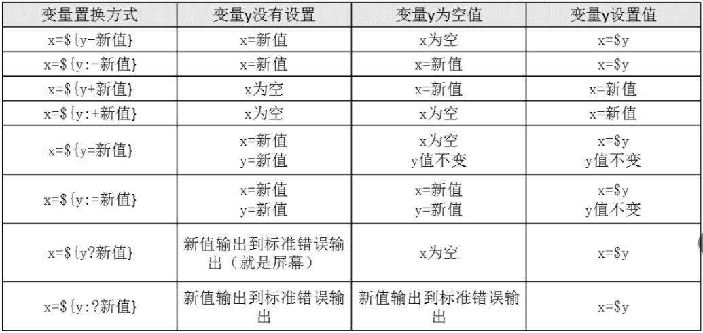

编辑作者：钟全龙

版权授予：哔哩哔哩-天阁创客official、微信公众号-天阁创客official

联系作者：tiangesec@qq.com(QQ:1072441436)

错误反馈：请发邮箱tiangesec@qq.com，请使用Word将错误写下，并附上截图，放置在邮箱附件中，改写反馈。

优化建议：请发邮箱tiangesec@qq.com，请使用Word需要改进的地方写下，并附上截图；若有内容添加建议，请在word文件中表明，并放置在邮箱附件中，感谢建议。

----

**基于deepin的shell编程 更新日志**

版本号带有`Update`的表示为大体内容没有完成，持续更新中

版本号带有`Release`的表示代替大体内容已经完成，待反馈和优化以及增加内容

版本号里面带有`Alpha`的代表内容在修改中

```
版本号解读：
V0.1--->是内容版本的更替，update.23.12.4是更新日期，release23.12.4是发布日期，alpha23.12.4是修改日期
```

> 版本更新V0.1.update23.12.28：

更新内容：1.1进程列表-2.9数组变量

> 版本更新V0.1.update23.12.29：

更新内容：3shell运算符-11.7其他选项

> 版本更新V0.2.update24.4.30：

更新内容：UI界面更新


-----

# shell编程

## Shell的基本功能

Deepin的Shell是Deepin操作系统中的一个重要组成部分，它为用户提供了一个与操作系统交互的界面。Shell是一种命令行解释器，用户可以通过它输入命令来执行各种操作，如文件管理、程序运行、系统配置等。

在Deepin操作系统中，Shell通常是Bash（Bourne-Again SHell）的一个版本，这是大多数Linux发行版中最常用的Shell。Bash具有强大的脚本语言能力，支持各种命令行操作，并且可以编写复杂的脚本程序。

用户可以通过Shell执行各种Linux命令，编写脚本自动化任务，以及进行系统管理和配置。Shell也是许多Linux发行版中默认的命令行解释器，因此，熟悉Shell对于Linux用户来说非常重要。在Deepin中，用户可以通过图形界面中的终端应用程序或通过系统的命令行界面来访问和使用Shell。

不同发行版本的Linux内置使用的默认shell是不一样的，有些是bash，有些是zsh，还有其他的，Ubuntu Linux就是使用的bash，kali Linux使用的是zsh。在后面使用父子shell的时候就可以体现出来。不同shell里面的语法大同小异。他们有区别，但不是没有关系。

### 1.1 进程列表

在使用shell命令的时候，在中间加上分号(;)即可实现同时操作多条命令，来提高效率，记得命令与命令之间要空格。进程列表是命令分组的一种。

**例**

```shell
zql@zql-PC:~$ pwd ; ls ; ll
/home/zql
code  com.hmja.ccompare  Desktop  Documents  Downloads  gcadlog  Music  Pictures  Videos
总计 36
drwxr-xr-x 3 zql zql 4096 11月 5日 13:17 code
drwxr-xr-x 2 zql zql 4096 10月 6日 16:43 com.hmja.ccompare
drwxr-xr-x 2 zql zql 4096 12月28日 19:38 Desktop
drwxr-xr-x 2 zql zql 4096 10月 9日 18:06 Documents
drwxr-xr-x 2 zql zql 4096 2023年 2月 7日 Downloads
drwxr-xr-x 2 zql zql 4096 10月 9日 18:06 gcadlog
drwxr-xr-x 2 zql zql 4096 2023年 2月 7日 Music
drwxr-xr-x 4 zql zql 4096 10月 6日 16:47 Pictures
drwxr-xr-x 2 zql zql 4096  7月 7日 10:11 Videos
```

### 1.2 优先级

- [ ] 第一顺位执行用绝对路径或相对路径执行的命令。
- [ ] 第二顺位执行别名。
- [ ] 第三顺位执行Bash的内部命令。
- [ ] 第四顺位执行按照$PATH环境变量定义的目录查找顺序找到的第一个命令。

### 1.3 Bash常用的快捷键

| **快捷键** | **作用**                                                     |
| ---------- | ------------------------------------------------------------ |
| CTRL+A     | 把光标移动到命令行开头。如果我们输入的命令过长，想要把光标移动到命令行开头时使用 |
| CTRL+E     | 把光标移动到命令行结尾                                       |
| CTRL+C     | 强制终止当前的命令                                           |
| CTRL+L     | 清屏，相当于clear命令                                        |
| CTRL+U     | 删除或剪切光标之前的命令。我输入了一行很长的命令，不用使用退格键一个一个字符的删除，使用这个快捷键会更加方便 |
| CTRL+K     | 删除或剪切光标之后的内容                                     |
| CTRL+Y     | 粘贴CTRL+U或CTRL+K剪切的内容                                 |
| CTRL+R     | 在历史命令中搜索，按下CTRL+R之后，就会出现搜索界面，只要输入搜索内容，就会从历史命令中搜索 |
| CTRL+D     | 退出当前终端                                                 |
| CTRL+Z     | 暂停，放入后台                                               |
| CTRL+S     | 暂停屏幕输出                                                 |
| CTRL+Q     | 回复屏幕输出                                                 |

### 1.4 重定向

#### 1.4.1 Bash的标准输入和输出

| 设备   | 设备文件名  | 文件描述符 | 类型         |
| ------ | ----------- | ---------- | ------------ |
| 键盘   | /dev/stdin  | 0          | 标准输入     |
| 显示器 | /dev/stdout | 1          | 标准输出     |
| 显示器 | /dev/stderr | 2          | 标准错误输出 |

#### 1.4.2 输出重定向


例

```shell
zql@zql-PC:~$ ls >> abc
zql@zql-PC:~$ pwd >> abc
zql@zql-PC:~$ cat abc
abc
code
com.hmja.ccompare
Desktop
Documents
Downloads
gcadlog
Music
Pictures
Videos
/home/zql
zql@zql-PC:~$
```

### 1.5 多命令执行符

#### 1.5.1 分号；

**语法**

```
commend1 ; commend2
```

**注意：**

在不同的命令之间添加分号即可，当有错误的命令在里面的时候它可以不影响执行，命令之间没有逻辑关系

例

```shell
zql@zql-PC:~$ ls ; date ; cd /home
abc  code  com.hmja.ccompare  Desktop  Documents  Downloads  gcadlog  Music  Pictures  Videos
2023年 12月 28日 星期四 20:49:04 CST
zql@zql-PC:/home$
```

可以看见，以上命令全部执行了，错误的命令也会执行，跑代码就很方便了

#### 1.5.2 逻辑符&&

**语法**

```
commend1 && commend2
```

**注意：**

改用法和上面的分号的用法区别是双&&前一条命令要正确执行后面的命令才会执行，第一条命令错误执行时，第二条命令不会执行。

例

```shell
[root@Lisa home]# ls && echo 'yes'
hacker
yes
[root@Lisa home]# ls && his
hacker
bash: his: command not found...
[root@Lisa home]# lsls && echo 'yes'
bash: lsls: command not found...
```

#### 1.5.3 逻辑符||

**语法**

```
commend1 || commend2
```

**注意：**

当第一个命令正确执行后，第二个就不会执行，当第一个命令执行不正确的时候，第二个命令就会执行。

例

```shell
zql@zql-PC:/home$ ls && echo 'yes' || echo 'no'
zql
yes
zql@zql-PC:/home$ lsiuhb && echo 'yes' || echo 'no'
-bash: lsiuhb：未找到命令
no
zql@zql-PC:/home$
```

### 1.6 Bash特殊符号

| **符号** | **作用**                                                     |
| -------- | ------------------------------------------------------------ |
| ‘’       | 单引号在单引号中所有的特殊符号，如“$”和+“”（反引号）都没有特殊含义,所有的符号都会失去意义 |
| “”       | 双引号在双引号中特殊符号都没有特殊含义，但是“$”、“~”和“\”是例外，拥有“调用变量的值”、“引用命令”和“转义符”的特殊含义 |
| ``       | 反引号括起来的内容是系统命令，在Bash中会先执行它。和$()作用一样，不过推荐使用$(0，因为反引号非常容易看错 |
| $()      | 和反引号作用一样，用来引用系统命令                           |
| ()       | 用于一串命令执行时，()中的命令会在子Shell中运行              |
| {}       | 用于一串命令执行时，{}}中的命令会在当前Shell中执行。也可以用于变量变形与替换 |
| []       | 用于变量的测试                                               |
| #        | 在shell脚本里面表示注释                                      |
| $        | 用于调用变量的值，如需要调用变量name的值时，需要用$name的方式得到的变量的值 |
| \        | 转义符，跟在之后的特殊符号将失去特殊含义，变为普通字符。如\$将输出“$”符号，而不当做是变量引用 |

例

```shell
#反引号``
zql@zql-PC:/home$ date
2023年 12月 28日 星期四 20:51:23 CST
zql@zql-PC:/home$ a=date
zql@zql-PC:/home$ echo $a
date
zql@zql-PC:/home$ a=`date`
zql@zql-PC:/home$ echo $a
2023年 12月 28日 星期四 20:51:44 CST
zql@zql-PC:/home$ b=$(ls /home)
zql@zql-PC:/home$ echo $b
zql
zql@zql-PC:/home$ echo "\$name"
$name
zql@zql-PC:/home$
```

### 1.7 父子shell

什么是父shell，什么是子shell，看看下面这张图片，当我们使用pstree命令的时候，我我们可以看到这个命令是在shell的进程下面，这里为什么有两个bash，是因为我们在命令行界面运行了bash，他就要单独开了一个bash在父shell下面，所以前面的bash就是父shell，后面的bash就是子shell，当前进入子shell后，你的历史命令就会消失。


**例**

```shell
#当前的进程为ps和zsh
zql@zql-PC:/home$ ps --forest
    PID TTY          TIME CMD
   2725 pts/1    00:00:00 bash
   3474 pts/1    00:00:00  \_ ps
zql@zql-PC:/home$

#进入子shell，当前进程里面多了个\_ zsh
zql@zql-PC:/home$ bash
zql@zql-PC:/home$ ps --forest
    PID TTY          TIME CMD
   2725 pts/1    00:00:00 bash
   3502 pts/1    00:00:00  \_ bash
   3535 pts/1    00:00:00      \_ ps
zql@zql-PC:/home$

#退出子shell，再次查看当前的进程
zql@zql-PC:/home$ exit
exit
zql@zql-PC:/home$ ps --forest
    PID TTY          TIME CMD
   2725 pts/1    00:00:00 bash
   3582 pts/1    00:00:00  \_ ps
```

- [ ] ()执行一串命令时，需要重新开一个子shell进行执行;
- [ ] {}执行一串命令时，是在当前shell执行;
- [ ] ()和}都是把一串的命令放在括号里面，并且命令之间用;号隔开;
- [ ] ()最后一个命令可以不用分号;
- [ ] {}最后一个命令要用分号;
- [ ] {}的第一个命令和左括号之间必须要有一个空格;
- [ ] ()里的各命令不必和括号有空格;
- [ ] ()和{}中括号里面的某个命令的重定向只影响该命令，但括号外的重定向则影响到括号里的
- [ ] 所有命令;

例


我们来看看上面的代码，我们在shell里面定义了一个变量name，值为zhong，当我们使用小括号执行的时候就变了，这是为什么，这里不是覆盖前面的值，而是在小括号里面的命令开了一个子shell，我们当前的shell就可以看作为父shell，所以，我们再次执行命令的时候看到的值还是zhong，如果是赋值被覆盖，那么最后一条命令就还是1；


当我们使用大括号的时候，他执行的命令就是在父shell里面执行的，而且必须注意的是，命令前后必须空格，否者就会像最后一行一样，语法是错误的。

查看当前是否使用了子shell还可以使用echo $BASH_SUBSHELL,注意不一定是BASH_SUBSHELL，要根据你当前使用的Linux默认的shell来命名，比如kali就是ZSH_SUBSHELL,如何查看当前使用的是bash还是其他的shell方式有很多，比如ps进程查看等。


**注意：当echo $BASH_SUBSHELL的值是0的时候表示没有创建子shell来执行这些命令，如果输出的是1，表示创建了子shell来执行命令。**

**例**

```shell
zql@zql-PC:~$ (pwd ; ls hallo* ; ll ; echo $BASH_SUBSHELL)
/home/zql
hallo.c  hallo.cpp  hallo.java  hallo.md  hallo.py  hallo.sh  hallo.tar  hallo.txt
总计 40
-rw-r--r-- 1 zql zql   95 12月28日 20:48 abc
drwxr-xr-x 3 zql zql 4096 11月 5日 13:17 code
drwxr-xr-x 2 zql zql 4096 10月 6日 16:43 com.hmja.ccompare
drwxr-xr-x 2 zql zql 4096 12月28日 19:38 Desktop
drwxr-xr-x 2 zql zql 4096 10月 9日 18:06 Documents
drwxr-xr-x 2 zql zql 4096 2023年 2月 7日 Downloads
drwxr-xr-x 2 zql zql 4096 10月 9日 18:06 gcadlog
-rw-r--r-- 1 zql zql    0 12月28日 20:57 hallo.c
-rw-r--r-- 1 zql zql    0 12月28日 20:58 hallo.cpp
-rw-r--r-- 1 zql zql    0 12月28日 20:57 hallo.java
-rw-r--r-- 1 zql zql    0 12月28日 20:58 hallo.md
-rw-r--r-- 1 zql zql    0 12月28日 20:57 hallo.py
-rw-r--r-- 1 zql zql    0 12月28日 20:57 hallo.sh
-rw-r--r-- 1 zql zql    0 12月28日 20:58 hallo.tar
-rw-r--r-- 1 zql zql    0 12月28日 20:58 hallo.txt
drwxr-xr-x 2 zql zql 4096 2023年 2月 7日 Music
drwxr-xr-x 4 zql zql 4096 10月 6日 16:47 Pictures
drwxr-xr-x 2 zql zql 4096  7月 7日 10:11 Videos
1
zql@zql-PC:~$
```

### 1.8 高效的子shell

#### 1.8.1 后台模式

一种高效的子shell用法就是后台模式。演示后台模式的命令是sleep，睡眠的意思是吧，进程睡眠，该命令在shell脚本中常用于引入一段暂停时间。在命令的末尾加上&就会将命令至于后台模式。

**例**

```shell
#将他放置后台30s，使用ps查看当前的进程
zql@zql-PC:~$ sleep 30&
[1] 5118
zql@zql-PC:~$ ps -f
UID          PID    PPID  C STIME TTY          TIME CMD
zql         2725    2724  0 20:46 pts/1    00:00:00 -bash
zql         5118    2725  0 21:02 pts/1    00:00:00 sleep 30
zql         5128    2725  0 21:03 pts/1    00:00:00 ps -f
zql@zql-PC:~$ sleep 30&
[2] 5183
[1]   已完成               sleep 30
zql@zql-PC:~$

#可以使用jobs来查看当前的后台信息
zql@zql-PC:~$ sleep 30&
[3] 5241
zql@zql-PC:~$
zql@zql-PC:~$ jobs
[2]-  已完成               sleep 30
[3]+  运行中               sleep 30 &
zql@zql-PC:~$

#jobs -l可以查看更多的信息
zql@zql-PC:~$ sleep 30&
[4] 5266
zql@zql-PC:~$
zql@zql-PC:~$ jobs -l
[3]-  5241 运行中               sleep 30 &
[4]+  5266 运行中               sleep 30 &
zql@zql-PC:~$
```

注意：进入睡眠模式的时候的ID号和ps进程中睡眠模式的ID号是一样的。

##### 将进程列表放置后台

**例**

```shell
zql@zql-PC:~$ (sleep 2 ; echo $BASH_SUBSHELL ; sleep 2)&
[1] 5364
zql@zql-PC:~$ 1

[1]+  已完成               ( sleep 2; echo $BASH_SUBSHELL; sleep 2 )
zql@zql-PC:~$
```

#### 1.8.2 协程

协程就是在后台生成一个子shell，二是在这个子shell里面执行命令。协程的处理需要用到oproc命令，将命令放置后台运行。

**例**

```shell
zql@zql-PC:~$ coproc sleep 10
[1] 5538
zql@zql-PC:~$
zql@zql-PC:~$ ps
    PID TTY          TIME CMD
   2725 pts/1    00:00:00 bash
   5538 pts/1    00:00:00 sleep
   5544 pts/1    00:00:00 ps
zql@zql-PC:~$
zql@zql-PC:~$
[1]+  已完成               coproc COPROC sleep 10
zql@zql-PC:~$
```

**注意：协程是后台在运行，前台也可以进行交互，后台模式是进入了后台，无法再进行交互，除非退出来了或者再后面加上了&**，**加上&就会把命令放入后台，而不会进入后台里面**

```shell
zql@zql-PC:~$ coproc sleep 10
[1] 5630
zql@zql-PC:~$ jobs
[1]+  运行中               coproc COPROC sleep 10 &
zql@zql-PC:~$ jobs -l
[1]+  5630 运行中               coproc COPROC sleep 10 &
zql@zql-PC:~$
[1]+  已完成               coproc COPROC sleep 10
zql@zql-PC:~$
```

每次运行的时候，进程ID都是不一样的，但是还可以给进程起名字

**例**

```shell
zql@zql-PC:~$ bash
zql@zql-PC:~$
zql@zql-PC:~$ coproc myjob1 { sleep 10; } &
[1] 5734
zql@zql-PC:~$ jobs
[1]+  运行中               coproc myjob1 { sleep 10; } &
zql@zql-PC:~$
```

当我们进程没有结束的时候开启新的进程的时候，旧的进程依然会运行，直到它结束

```shell
zql@zql-PC:~$ coproc sleep 10
[1] 5814
zql@zql-PC:~$ ps
    PID TTY          TIME CMD
   2725 pts/1    00:00:00 bash
   5717 pts/1    00:00:00 bash
   5814 pts/1    00:00:00 sleep
   5822 pts/1    00:00:00 ps
zql@zql-PC:~$
zql@zql-PC:~$
[1]+  已完成               coproc COPROC sleep 10
zql@zql-PC:~$ coproc sleep 10
[1] 5925
zql@zql-PC:~$ coproc sleep 10
bash: 警告：execute_coproc: 副进程 [5925:COPROC] 仍然存在
[2] 5928
zql@zql-PC:~$
```

##### 结合协程与进程列表

**例**

```shell
zql@zql-PC:~$ coproc ( sleep 5 ; sleep 3)
[1] 6036
zql@zql-PC:~$
zql@zql-PC:~$ ps --forest
    PID TTY          TIME CMD
   2725 pts/1    00:00:00 bash
   5717 pts/1    00:00:00  \_ bash
   6036 pts/1    00:00:00      \_ bash
   6048 pts/1    00:00:00      |   \_ sleep
   6050 pts/1    00:00:00      \_ ps
zql@zql-PC:~$
zql@zql-PC:~$ ps --forest
    PID TTY          TIME CMD
   2725 pts/1    00:00:00 bash
   5717 pts/1    00:00:00  \_ bash
   6062 pts/1    00:00:00      \_ ps
[1]+  已完成               coproc COPROC ( sleep 5; sleep 3 )
zql@zql-PC:~$

#从后面两组信息可以看出，在我们运行协程和进程列表的时候，会再开一个bash子shell，然后再里面运行sleep进程列表，运行完成之后bash子shell会自动关闭，留下一个完成的信息。
#注意：我是在zsh里面开了子shell bash，所以他会有两个bash，第二个bash才是我们进程协程和进程列表开启的子shell。
```

### 1.9 外部命令与内建命令

#### 1.9.1 外部命令

外部命令也叫文件系统命令，是存在bash shell之外的程序，通常位于/bin、/usr/bin、/sbin或/usr/sbin目录中，例如ps就是外部的命令，使用which和type可以找到对应的文件名。

**例**

```shell
zql@zql-PC:~$ which ps
/usr/bin/ps
zql@zql-PC:~$ which cd
zql@zql-PC:~$
```

可以看见ps是外部的命令，而cd则是shell内建命令。

```shell
zql@zql-PC:~$ type pwd
pwd 是 shell 内建
zql@zql-PC:~$ type find
find 是 /usr/bin/find
zql@zql-PC:~$
```

find没想到吧他也是外部命令，其实我也没想到。

当执行外部命令的时候就会创建一个子进程，这种操作叫做衍生。

**例**

```shell
zql@zql-PC:~$ ps
    PID TTY          TIME CMD
   2725 pts/1    00:00:00 bash
   5717 pts/1    00:00:00 bash
   6201 pts/1    00:00:00 ps
zql@zql-PC:~$ ps -f
UID          PID    PPID  C STIME TTY          TIME CMD
zql         2725    2724  0 20:46 pts/1    00:00:00 -bash
zql         5717    2725  0 21:07 pts/1    00:00:00 bash
zql         6208    5717  0 21:10 pts/1    00:00:00 ps -f
zql@zql-PC:~$
```

所以你就知道为什么之前查看进程的时候每次都能看到ps，因为他是一个外部的命令，调用的时候会衍生子进程，在子进程里面执行外部命令，注意他们的PID号是不一样的。

当出现进程衍生的时候就会消耗时间和资源来设置新的子进程环境，所以外部命令的开销较高。

#### 1.9.2 内建命令

内建命令与外部命令不同，它们不需要创建子进程来执行，他们和shell编译成了一体，作为shell的组成部分存在。

有些命令既有内建命令也有外部命令，例如pwd和echo。使用type -a即可看见他们所有的路径。

```shell
zql@zql-PC:~$ type -a pwd
pwd 是 shell 内建
pwd 是 /usr/bin/pwd
pwd 是 /bin/pwd
zql@zql-PC:~$ type -a echo
echo 是 shell 内建
echo 是 /usr/bin/echo
echo 是 /bin/echo
zql@zql-PC:~$ type -a cd
cd 是 shell 内建
zql@zql-PC:~$
```

可以看见echo与pwd还有别的路径，他们不仅仅是shell内建命令。

注意：which只能看见外部命令

#### 1.9.3 命令别名

查看当前系统可以使用的别名可以使用命令alias

```shell
-a    查看当前所有的可以使用的别名
```

**例**

```shell
# 进入子shell
zql@zql-PC:~$ bash
# 查看别名列表
zql@zql-PC:~$ alias -p
alias ls='ls --color=auto'
#退出子shell
zql@zql-PC:~$ exit
exit
#查看别名列表
zql@zql-PC:~$ alias -p
alias ll='ls -l'
alias ls='ls --color=auto'
```

**设置别名**

语法

```shell
alias 别名='命令'
```

**例**

```shell
zql@zql-PC:~$ alias l='ls -CF'
zql@zql-PC:~$ alias la='ls -A'
zql@zql-PC:~$ alias -p
alias l='ls -CF'
alias la='ls -A'
alias ll='ls -l'
alias ls='ls --color=auto'
zql@zql-PC:~$ alias li='ls -i'
zql@zql-PC:~$ la
abc                .config         gcadlog     hallo.sh    Music                      .themes
.bash_history      .deepin-themes  .gtkrc-2.0  hallo.tar   Pictures                   Videos
.bash_logout       .deepinwine     hallo.c     hallo.txt   .pki                       .vscode
.bashrc            Desktop         hallo.cpp   .icons      .profile                   .Xauthority
.cache             .dmrc           hallo.java  .imwheelrc  .Public                    .xsession-errors
code               Documents       hallo.md    .linglong   .sudo_as_admin_successful  .xsession-errors.old
com.hmja.ccompare  Downloads       hallo.py    .local      .Templates
zql@zql-PC:~$ li
2621458 abc                2622349 Documents  2622032 hallo.cpp   2622002 hallo.sh   2622316 Pictures
2632317 code               2622348 Downloads  2622031 hallo.java  2622033 hallo.tar  2622350 Videos
2621748 com.hmja.ccompare  2631954 gcadlog    2622034 hallo.md    2622035 hallo.txt
2622363 Desktop            2622030 hallo.c    2622024 hallo.py    2622365 Music
```

**注意：被定义的别名仅在当前的shell内有效，他是内建命令。**

**删除自己定义的别名**

语法

```shell
unalias 别名
```

**例**

```
zql@zql-PC:~$ unalias li
zql@zql-PC:~$ li
-bash: li：未找到命令
zql@zql-PC:~$
```

## 变量（bash）

### 2.1 变量命名规侧

- [ ] 变量名必须以字母或下划线打头，名字中间只能由字母、数字和下划线组成
- [ ] 变量名的长度不得超过255个字符
- [ ] 变量名在有效的范围内必须是唯一的
- [ ] 在Bash中，变量的默认类型都是字符串型
- [ ] 变量用等号连接值，等号左右两边不能有空格
- [ ] 变量的值如果有空格，需要使用单引号或双引号包括如：“test="hello world!””。其中双引号括起来的内容“$”、“\”和反引号都拥有特殊含义，而单引号括起来的内容都是普通字符。
- [ ] 在变量的值中，可以使用“\”转义符。
- [ ] 如果需要增加变量的值，那么可以进行变量值的叠加。不过变量需要用双引号包含“$变量名“或用${变量名}包含变量名。

例

```
a=10,
a=qbcd
```

像这样可以变化的参数就是变量，他的值是不定的，可以进行覆盖变化。

### 2.2 变量的分类（按照存储类型）

- [ ] 字符串型
- [ ] 整型
- [ ] 浮点型
- [ ] 日期型

### 2.3变量的分类

> 用户自定义变量

- [ ] 变量自定义的

> 环境变量

- [ ] 这种变量中主要保存的是和系统操作环境相关的数据。变量可以自定义，但是对系统生效的环境变量名和变量作用是固定的

> 位置参数变量

- [ ] 这种变量主要是用来向脚本当中传递参数或数据的，变量名不能自定义，变量作用是固定的，（属于预定义变量的一种）

> 预定义变量

- [ ] 是Bash中已经定义好的变量，变量名不能自定义，变量作用也是固定的

| 变量分类           | 名称   | 作用   | 内容   |
| ------------------ | ------ | ------ | ------ |
| 用户自定义变量     | 自定义 | 自定义 | 自定义 |
| 用户自定义环境变量 | 自定义 | 自定义 | 自定义 |
| 系统自带环境变量   | 确定   | 确定   | 自定义 |
| 位置参数变量       | 确定   | 确定   | 自定义 |
| 预定义变量         | 确定   | 确定   | 自定义 |

### 2.4 定义变量

**语法**

```
变量名=值
变量名="string"
```

**注意：等号之间不能空格,因为在操作系统中使用命令才用空格，如果你定义变量使用了空格，系统会认为是你使用了bash命令。**

**例**

```shell
zql@zql-PC:~$ x=5
zql@zql-PC:~$ echo $x
5
```

```shell
zql@zql-PC:~$ m1=xyz
zql@zql-PC:~$ echo m1
m1
zql@zql-PC:~$
```

#### 2.4.1 调用变量

**语法**

```shell
echo $变量名
```

**注意：Linux系统中，变量的值默认是字符串类型（String）。**

例

```shell
zql@zql-PC:~$ x=5
zql@zql-PC:~$ y=6
zql@zql-PC:~$ z=x+y
zql@zql-PC:~$ echo $z
x+y
zql@zql-PC:~$ z=$x+$y
zql@zql-PC:~$ echo $z
5+6
```

#### 2.4.2 变量叠加

**语法**

```shell
变量名x="$变量名x"叠加的值
变量名x=${变量名x}叠加的值
```

例

```shell
zql@zql-PC:~$ x=123
zql@zql-PC:~$ x="$x"456
zql@zql-PC:~$ echo $x
123456
zql@zql-PC:~$ x=${x}789
zql@zql-PC:~$ echo $x
123456789
```

#### 2.4.3 变量查看

> set    查看所有的变量

直接使用set命令的时候就是查收看所有的变量

选项

```shell
-u    如果设定此选项，调用未声明变量时会报错（默认无任何提示）
-X  如果设定此选项，在命令执行之前会把命令先输出一次
```

在shell编程中，不存在的变量和变量值为空的时候调用出来都是空的，为了更好区分二者，使用set -u后不存在的变量就会报错，但是这是临时生效的，

例

```shell
zql@zql-PC:~$ echo $a


zql@zql-PC:~$ set -u
zql@zql-PC:~$ echo $a
-bash: a: 为绑定变量
zql@zql-PC:~$
```

#### 2.4.4 变量删除

**语法**

```shell
unset 变量名
```

### 2.5 环境变量

#### 2.5.1 全局环境变量

全局变量对于shell会话和所有生成的子shell都是可见的。

查看全局变量可以使用命令env和printenv

**例**

```shell
zql@zql-PC:~$ env
SHELL=/bin/bash
LANGUAGE=zh_CN
XDG_DATA_HOME=/home/zql/.local/share
XDG_CONFIG_HOME=/home/zql/.config
PWD=/home/zql
LOGNAME=zql
XDG_SESSION_TYPE=tty
MOTD_SHOWN=pam
HOME=/home/zql
LANG=zh_CN.UTF-8
LS_COLORS=bd=38;5;68;1:ca=38;5;17:cd=38;5;132;1:di=38;5;105:do=38;5;127:ex=38;5;80:pi=38;5;126:fi=38;5;167:ln=38;5;63:mh=38;5;99;1:or=48;5;197;38;5;228;1:ow=38;5;220;1:sg=48;5;234;38;5;100;1:su=38;5;9;1:so=38;5;197:st=38;5;86;48;5;234:tw=48;5;235;38;5;139;3:*LS_COLORS=48;5;89;38;5;197;1;3;4;7:*.BAT=38;5;108:*.ex

内容太长--省略--

:*.service=38;5;81:*@.service=38;5;45:*.socket=38;5;75:*.device=38;5;24:*.mount=38;5;115:*.automount=38;5;114:*.swap=38;5;113:*.target=38;5;73:*.path=38;5;116:*.timer=38;5;111:*.snapshot=38;5;139:*.desktop=38;5;113:*.crdownload=38;5;38:*.crx=38;5;13:
SSH_CONNECTION=192.168.8.1 24175 192.168.8.106 22
LINGLONG_ROOT=/persistent/linglong
XDG_CACHE_HOME=/home/zql/.cache
XDG_SESSION_CLASS=user
TERM=xterm-256color
USER=zql
SHLVL=1
XDG_SESSION_ID=3
XDG_RUNTIME_DIR=/run/user/1000
SSH_CLIENT=192.168.8.1 24175 22
XDG_DATA_DIRS=/persistent/linglong/entries/share:/home/zql/.local/share/linglong/entries/share:/usr/local/share:/usr/share
PATH=/usr/local/bin:/usr/bin:/bin:/usr/local/games:/usr/games:/sbin:/usr/sbin
DBUS_SESSION_BUS_ADDRESS=unix:path=/run/user/1000/bus
SSH_TTY=/dev/pts/1
_=/usr/bin/env
OLDPWD=/home
zql@zql-PC:~$
```

可以看见二者几乎是一模一样。但是当要查看个别环境变量的时候就只能使用printenv。

**例**

```shell
zql@zql-PC:~$ printenv HOME
/home/zql
zql@zql-PC:~$ printenv home
zql@zql-PC:~$ env HOME
env: "HOME": 没有那个文件或目录
zql@zql-PC:~$
```

可以看见查看个别环境变量的时候环境变量必须大写，env也是不能查看的。

##### 查看当前的环境变量

**语法**

```shell
echo $PATH 
```

例


#### 2.5.2 局部变量

局部变量只能在定义的进程中可见。

set、printenv、env命令之间的差距很细微，set命令既会显示全局和局部环境变量、用户自定义变量以及局部shell函数，还会按照字母顺序对结果进行排序。与set命令不同，env命令和printenv命令既不会对变量进行排序，也不会输出局部环境变量、局部用户自定义变量以及局部shell函数。在这种情况下，env命令和printenv命令的输出是重复的。不过，env命令有printenv命令不具备的一个功能，这使其略胜一筹。

#### 2.5.3 设置环境变量

**语法**

```shell
export 变量名=变量值
```

#### 2.5.4 环境变量与自定义变量的区别

环境变量和用户自定义变量最主要的区别在于，环境变量是全局变量，而用户自定义变量是局部变量。用户自定义变量只在当前的Shellr中生效，而环境变量会在当前Shel和这个Shell的所有子Shell当中生效

变量可以自定义，但是对系统生效的环境变量名和变量作用是固定的

当我们执行脚本的时候就需要指明脚本的路径，绝对路径或者是相对路径，如果向直接使用脚本命令就需要将该文将放入bin目录或者是将该文件目录添加到环境变量中去。

#### 2.5.5 添加PATH变量的值

```shell
PATH="$PATH":/root/sh
```

#### 2.5.6 常用的环境变量

```shell
HOSTNAME:主机名
SHELL:当前的shell
TERM:终端环境
HISTSIZE:历史命令条数
SSH_CLIENT:当前操作环境是用ssh连接的，这里记录客户端ip
SSH_TTY:ssh连接的终端时pts/1
USER：当前登灵录的用户
```

#### 2.5.7 PS1环境变量

PS1变量是一种命令提示符设置，可以定义自己喜欢的提示符。

**语法**

```shell
export PS1=' [\选项 ... \选项] '
```

注意：目录前面有空格，[ ]外有空格

**选项**

```shell
\d:显示日期，格式为“星期月日”
\h:显示简写主机名。如默认主机名“1 ocalhost”
\H:显示完整的主机名。如默认主机名"'localhost..localdomain”
\t:显示24小时制时间，格式为“HH:MM:SS”
\T:显示12小时制时间，格式为“HH:MM:SS”
\A:显示24小时制时间，格式为“HH:MM'
\u:显示当前用户名
\W:显示当前所在目录的完整名称
\W:显示当前所在目录的最后一个目录
\$:提示符。如果是r0ot用户会显示提示符为“#”，如果是普通用户会显示提示符为“$”
\A:显示24小时制时间，格式为“H:MM”
@:显示l2小时制时间，格式为“HH:MMam/pm”
\u:显示当前用户名
\v:显示Bash的版本信息
\#:执行的第几个命令
```

**例**


- [ ] \u就是root用户;
- [ ] @;
- [ ] \h当前的主机名zql;
- [ ] \W当前目录的最后一个目录名称~;
- [ ] \$是提示符#

**在Linux系统登录是主要生效的环境变量配置文件有以下五个**

- [ ] /etc/profile
- [ ] /etc/profile.d/*.sh
- [ ] ~/.bash_profile
- [ ] ~/.bashrc
- [ ] /etc/bashrc

#### 2.5.8 环境变量持久化

对全局环境变量（Linux系统的所有用户都要用到的变量）来说，可能更倾向于将新的或修改过的变量设置放在/etc/profile文件中，但这可不是什么好主意。如果升级了所用的发行版，则该文件也会随之更新，这样一来，所有定制过的变量设置可就都没有了。最好在/etc/profile.d目录中创建一个以.sh结尾的文件。把所有新的或修改过的全局环境变量设置都放在这个文件中。在大多数发行版中，保存个人用户永久性bash shell变量的最佳地点是$HOME/.bashrc文件。这适用于所有类型的shell进程。但如果设置了BASH_ENV变量，请记住：除非值为$HOME/.bashrc，否则，应该将非交互式shell的用户变量放在别的地方。

注意：图形化界面组成部分（比如GUI客户端）的环境变量可能需要在另外一些配置文件中设置，这和设置bash shell环境变量的文件不一样。

#### 2.5.9 系统语序

##### locale 设置规则

<语言>_<地区>.<字符集编码><@修正值>

```shell
zh_CN.utf8

zh：表示中文
CN：表示大陆地区
Utf8：表示字符集

de_DE.utf-8@euro

de：表示德语
DE：表示德国
Utf-8：表示字符集
euro：表示按照欧洲习惯加以
```

##### 查询当前系统语系    locale

```shell
LANG:定义系统主语系的变量
LCALL:定义整体语系的变量
```

当前所有启动的locale

```shell
LANG=zh_CN.UTF-8
LC_CTYPE="zh_CN.UTF-8"
LC_NUMERIC="zh_CN.UTF-8"
LC_TIME="zh_CN.UTF-8"
LC_COLLATE="zh_CN.UTF-8"
LC_MONETARY="zh_CN.UTF-8"
LC_MESSAGES="zh_CN.UTF-8"
LC_PAPER="zh_CN.UTF-8"
LC_NAME="zh_CN.UTF-8"
LC_ADDRESS="zh_CN.UTF-8"
LC_TELEPHONE="zh_CN.UTF-8"
LC_MEASUREMENT="zh_CN.UTF-8"
LC_IDENTIFICATION="zh_CN.UTF-8"
LC_ALL=
```

注意：

```shell
LANG： LANG的优先级是最低的，它是所有LC*变量的默认值，下方所有以LC开头变量（LC_ALL除外）中，        
       如果存在没有设置变量值的变量，那么系统将会使用LANG的变量值来给这个变量进行赋值。
       如果变量有值，则保持不变
LC_CTYPE：用于字符分类和字符串处理，控制所有字符的处理方式，包括字符编码，
          字符是单字节还是多字节，如何打印等，非常重要的一个变量。
LC_NUMERIC：用于格式化非货币的数字显示
LC_TIME：用于格式化时间和日期
LC_COLLATE：用于比较和排序
LC_MONETARY：用于格式化货币单位
LC_MESSAGES：用于控制程序输出时所使用的语言，主要是提示信息，错误信息，
             状态信息，标题，标签，按钮和菜单等
LC_PAPER：默认纸张尺寸大小
LC_NAME：姓名书写方式
LC_ADDRESS：地址书写方式
LC_TELEPHONE：电话号码书写方式
LC_MEASUREMENT：度量衡表达方式
LC_IDENTIFICATION：locale对自身包含信息的概述
LCALL：它不是环境变量，它是一个宏，它可通过该变量的设置覆盖所有LC变量，
       这个变量设置之后，可以废除LC_的设置值，使得这些变量的设置值与LC_ALL的值一致，
       注意LANG变量不受影响。
```

**优先级：LC\*ALL > LC_\*> LANG**

查看当前系统语序

```shell
echo $LANG
```

查看Linux支持的所有语系

```shell
locale -a | more
```

查看默认语序

```shell
cat /etc/sysconfig/i18n
```

##### 设置系统的 locale

```shell
#可以修改/etc/profile文件
#修改/etc/profile文件，在最下面增加
export LC_ALL=zh_CN.utf8
export LANG=zh_CN.utf8

#命令行中使用命令 source 下配置文件，使其生效
#修改/etc/locale.gen文件
#将注释打开即可，修改完成后，执行下 locale-gen 命令使其生效
#en_SG ISO-8859-1
en_US.UTF-8 UTF-8
#en_US ISO-8859-1

#命令行模式
localectl set-locale LANG=en_US.UTF-8
修改/etc/default/locale

#注销一下，使其生效
LANG=“en_US.UTF-8”
LANGUAGE=“en_US:en”

#创建/etc/locale.conf文件
LANG=en_AU.UTF-8
LC_COLLATE=C
LC_TIME=en_DK.UTF-8
# 使其生效执行
source 文件名
```

### 2.6 位置参数变量


例

```shell
#!/bin/bash

a=$1
b=$2

sum=$(( $a + $b ))

echo $sum
```

**注意：**

- [ ] $*会把每一个参数看成一个整体
- [ ] $@会把每个参数当成独立的个体
- [ ] 当使用for循环的时候就可以看出二者明显的差距

### 2.7 预定义变量


例

```shell
zql@zql-PC:~$ echo $$
2725
zql@zql-PC:~$ echo $!
5630
zql@zql-PC:~$ echo $?
0
zql@zql-PC:~$
```

#### 2.7.1 逻辑&&与||

> $$当前面与后面的语句都执行的时候，返回0
>
> ||当返回0的之后就是前面的语句执行，否则就是后面的语句执行

#### 2.7.2 接受键盘输入（input）    read

**语法**

```shell
read 选项 变量名
```

**选项**

```shell
-p： “提示信息”：在等待read输入时，输出提示信息
-t： 秒数：read命令会一直等待用户输入，使用此选项可以指定等待时间
-n： 字符数：read命令只接受指定的字符数，就会执行
-s： 隐藏输入的数据，适用于机密信息的输入
```

例

```shell
#!/bin/bash


#-p： “提示信息”：在等待read输入时，输出提示信息
#-t： 秒数：read命令会一直等待用户输入，使用此选项可以指定等待时间
#-n： 字符数：read命令只接受指定的字符数，就会执行
#-s： 隐藏输入的数据，适用于机密信息的输入
#read -t 等待用户输入30秒 -p 提示：请你输入一个数字 变量
read -t 30 -p "请你输入一个数字：" num1

read -t 30 -p "请再次输入一个数字" num2

sum=$(( $num1 + $num2 ))

echo $sum
```

**注意**

```
脚本开头必须是#!/bin/bash
```

### 2.8 声明变量类型

> declare

使用declare声明变量类型

**语法**

```shell
declare [+/-] [选项] 变量名
```

**选项**

```shell
-        给变量设定类型属性
+        取消变量的类型属性
-a        将变量声明为数组型
-i        将变量声明为整数型integer
-r        将变量声明为只读变量，设置后不能修改该变量的值，无法删除变量，也不能修改只读的属性
-x        将变量声明为环境变量
-p        显示置顶变量的被声明类型
```

例

```shell
zql@zql-PC:~$ a=1
zql@zql-PC:~$ b=2
zql@zql-PC:~$ c=$a+$b
zql@zql-PC:~$ echo $c
1+2
zql@zql-PC:~$ declare -i c=$a+$b
zql@zql-PC:~$ echo $c
3
```

**输出数组变量类型**

通过下标来保存多个数据

例

```shell
#首先声明数组类型
zql@zql-PC:~$ declare -a name[0]="zql"
zql@zql-PC:~$ name[1]="tr"
zql@zql-PC:~$ name[2]="kgm"
zql@zql-PC:~$ name[3]="lb"
zql@zql-PC:~$ echo ${name[*]}
zql tr kgm lb
zql@zql-PC:~$ echo ${name[0]}
zql
```

### 2.9 数组变量

环境变量的一个很酷的特性是可以作为数组使用。数组是能够存储多个值的变量。这些值既可以单独引用，也可以作为整体引用

**语法**

```
变量名=(值 值 值...值)
```

**例**

```shell
zql@zql-PC:~$ test=(Java C Python PHP Go)
zql@zql-PC:~$ echo $test
Java
zql@zql-PC:~$ echo ${test[2]}
Python
zql@zql-PC:~$ echo ${test[1]}
C
zql@zql-PC:~$ echo ${test[0]}
Java
zql@zql-PC:~$ echo ${test[*]}
Java C Python PHP Go
zql@zql-PC:~$
```

> 删除数组

**语法**

```
unset 数组名
```

**例**

```shell
zql@zql-PC:~$ unset test
zql@zql-PC:~$ echo ${test[*]}

zql@zql-PC:~$
```

## Shell运算符

- [ ] 第一种运算方法就是**declare数值运算法**，但是不推荐使用；
- [ ] 第二种是使用**expr命令和let来运算**，不推荐使用，运算符前后必须有空格；
- [ ] 第三种是使用**$((运算式))两个小括号阔以换成[]**进行运算，推荐使用

例

```shell
#第一种运算方法
zql@zql-PC:~$ a=1
zql@zql-PC:~$ b=2
zql@zql-PC:~$ c=$a+$b
zql@zql-PC:~$ echo $c
1+2
zql@zql-PC:~$ declare -i c=$a+$b
zql@zql-PC:~$ echo $c
3

#第二种运算方法
zql@zql-PC:~$ d=$(expr $a + $b)
zql@zql-PC:~$ echo $d
3
zql@zql-PC:~$ let e=$a+$b
zql@zql-PC:~$ echo $e
3
zql@zql-PC:~$

#第三种运算方法，中间运算符和括号可以没有空格
zql@zql-PC:~$ aa=11
zql@zql-PC:~$ bb=22
zql@zql-PC:~$ cc=$(( $aa + $bb ))
zql@zql-PC:~$ echo $cc
33
zql@zql-PC:~$

#混合运算
zql@zql-PC:~$ a=100
zql@zql-PC:~$ b=50
zql@zql-PC:~$ c=45
zql@zql-PC:~$ value=$[$a * ($b - $c)]
zql@zql-PC:~$ echo $value
500
zql@zql-PC:~$
```

### 3.1 运算符的优先级


### 3.2 运算方法

例1

```shell
#!/bin/bash

#定义变量输出
values=$(( $1 $2 $3 ))
#输出值
echo $values
-----------------------------------------------------------------------------------------
root@Hacker:~/sh# count3.sh 1 + 2
3
root@Hacker:~/sh# count3.sh 6 / 3
2
root@Hacker:~/sh# count3.sh 6 - 3
3
```

例2

```shell
#!/bin/bash

#输入条件
read -t 30 -p "Please input num1:" num1
read -t 30 -p "Please input num2:" num2
read -n1 -t 30 -p "Please input operato[+-*/]:" oper
echo -e "\n"

#判断符号是否正确
#利用&&进行逻辑输出，前者正确输出，后者就会输出，输出后就退出
[ "$oper" == "+" ] && echo "$(( $num1 + $num2 ))" && exit
[ "$oper" == "-" ] && echo "$(( $num1 - $num2 ))" && exit
[ "$oper" == "*" ] && echo "$(( $num1 * $num2 ))" && exit
[ "$oper" == "/" ] && echo "$(( $num1 / $num2 ))" && exit

#输入错误的时候
echo "输如错误或有内容未输入！"
-----------------------------------------------------------------------------------------
zql@zql-PC:~$ sudo vim count.sh
请输入密码:
验证成功
zql@zql-PC:~$ sudo chmod +x count.sh

--加法--
zql@zql-PC:~$ ./count.sh
Please input num1:1
Please input num2:2
Please input operato[+-*/]:+

3
--减法--
zql@zql-PC:~$ ./count.sh
Please input num1:4
Please input num2:2
Please input operato[+-*/]:-

2
--乘法--
zql@zql-PC:~$ ./count.sh
Please input num1:1
Please input num2:3
Please input operato[+-*/]:*

3
--除法--
zql@zql-PC:~$ ./count.sh
Please input num1:6
Please input num2:3
Please input operato[+-*/]:/

2
--输入错误或不输入--
zql@zql-PC:~$ ./count.sh
Please input num1:2
Please input num2:2
Please input operato[+-*/]:


zql@zql-PC:~$

输如错误或有内容未输入！
zql@zql-PC:~$ ./count.sh
Please input num1:2
Please input num2:+
Please input operato[+-*/]:+

./count.sh:行11: 2 + + ：语法错误: 需要操作数 (错误符号是 "+ ")
zql@zql-PC:~$

--混合运算--
zql@zql-PC:~$ a=$(( 4+9*5/3))
zql@zql-PC:~$ echo $(( (3+5)*4 ))
32
zql@zql-PC:~$
```

**--逻辑或--**

同为假才假，否则为真，同为0为0，否则为1，两个0才为0，其余为1

```shell
zql@zql-PC:~$ echo $(( 1||1 ))
1
zql@zql-PC:~$ echo $(( 1||0 ))
1
zql@zql-PC:~$ echo $(( 0||0 ))
0
```

**--逻辑与--**

同为真才真，否则为假，同为1为1，否则为0，两个1才为1，其余为0

```shell
zql@zql-PC:~$ echo $(( 0&&0 ))
0
zql@zql-PC:~$ echo $(( 0&&1 ))
0
zql@zql-PC:~$echo $(( 1&&1 ))
1
```

**--按位与--**

同为真才真，否则为假，同为1为1，否则为0，两个1才为1，其余为0

```shell
zql@zql-PC:~$ echo $(( 1&1 ))
1
zql@zql-PC:~$ echo $(( 1&0 ))
0
zql@zql-PC:~$ echo $(( 0&0 ))
0
```

**--按位或--**

两个假才假，否则为真，同为0为0，否则为1，两个0才为0，其余为1

```shell
zql@zql-PC:~$ echo $(( 1|1 ))
1
zql@zql-PC:~$echo $(( 1|0 ))
1
zql@zql-PC:~$ echo $(( 0|0 ))
0
zql@zql-PC:~$ echo $(( 0|1 ))
1
```

综上所述，逻辑与和按位与情况一样，反之

### 3.3 变量测试

变量的测试与内容置换，当我们不知道另外一个变量的时候，通过输出变量转换的式子，通过其中一个变量的值来进行另外一个变量的值的判断

**变量测试多在Linux脚本优化的时候使用**



例

可以通过以下示例来理解表的内容

```shell
#当y不存在的时候
zql@zql-PC:~$ unset y
zql@zql-PC:~$ x=${y-2}
zql@zql-PC:~$ echo $x
2

#当y存在为空的时候
zql@zql-PC:~$ y=""
zql@zql-PC:~$ x=${y-2}
zql@zql-PC:~$ echo $x

#当y存在不为空的时候
zql@zql-PC:~$ y=1
zql@zql-PC:~$ x=${y-2}
zql@zql-PC:~$ echo $x
1
```

## 配置文件

### 4.1 环境变量配置文件

环境变量配置文件中主要是定义对系统操作环境生效的系统默认环境变量，如PATH等。

登录的时候就会启用生效的环境变量由以下五个：

- [ ] /etc/profile

- [ ] /etc/profile.d/*.sh

- [ ] ~/.bash_profile

- [ ] ~/.bashrc

- [ ] /etc/bashrc

### 4.2 环境变量配置文件的功能

放在etc目录线面的会对所有用户生效，放在~家目录的只会对当前用户生效


#### 登录Shell

- [ ] **./etc/profile**

​        /etc/profile文件是系统中默认的bash shell的主启动文件。系统中的每个用户登录时都会执行这个启动文件。

​        etc/profile文件是bash shell默认的主启动文件。只要登录Linux系统，bash就会执行/etc/profile启动文件中的命令。

```shell
zql@zql-PC:~$ cat /etc/profile
# /etc/profile: system-wide .profile file for the Bourne shell (sh(1))
# and Bourne compatible shells (bash(1), ksh(1), ash(1), ...).

if [ "$(id -u)" -eq 0 ]; then
  PATH="/usr/local/sbin:/usr/local/bin:/usr/sbin:/usr/bin:/sbin:/bin"
else
  PATH="/usr/local/bin:/usr/bin:/bin:/usr/local/games:/usr/games:/sbin:/usr/sbin"
fi
export PATH

if [ "${PS1-}" ]; then
  if [ "${BASH-}" ] && [ "$BASH" != "/bin/sh" ]; then
    # The file bash.bashrc already sets the default PS1.
    # PS1='\h:\w\$ '
    if [ -f /etc/bash.bashrc ]; then
      . /etc/bash.bashrc
    fi
  else
    if [ "$(id -u)" -eq 0 ]; then
      PS1='# '
    else
      PS1='$ '
    fi
  fi
fi

if [ -d /etc/profile.d ]; then
  for i in /etc/profile.d/*.sh; do
    if [ -r $i ]; then
      . $i
    fi
  done
  unset i
fi
zql@zql-PC:~$
```

- [ ] .$HOME/.bash_profile
- [ ] .$HOME/.bashrc
- [ ] .$HOME/.bash_login
- [ ] .$HOME/.profile

```sh
zql@zql-PC:~$ cat $HOME/.bashrc
# ~/.bashrc: executed by bash(1) for non-login shells.
# see /usr/share/doc/bash/examples/startup-files (in the package bash-doc)
# for examples

# If not running interactively, don't do anything
case $- in
    *i*) ;;
      *) return;;
esac

# don't put duplicate lines or lines starting with space in the history.
# See bash(1) for more options
HISTCONTROL=ignoreboth

# append to the history file, don't overwrite it
shopt -s histappend

# for setting history length see HISTSIZE and HISTFILESIZE in bash(1)
HISTSIZE=1000
HISTFILESIZE=2000

# check the window size after each command and, if necessary,
# update the values of LINES and COLUMNS.
shopt -s checkwinsize

# If set, the pattern "**" used in a pathname expansion context will
# match all files and zero or more directories and subdirectories.
#shopt -s globstar

# make less more friendly for non-text input files, see lesspipe(1)
#[ -x /usr/bin/lesspipe ] && eval "$(SHELL=/bin/sh lesspipe)"

# set variable identifying the chroot you work in (used in the prompt below)
if [ -z "${debian_chroot:-}" ] && [ -r /etc/debian_chroot ]; then
    debian_chroot=$(cat /etc/debian_chroot)
fi

# set a fancy prompt (non-color, unless we know we "want" color)
case "$TERM" in
    xterm-color|*-256color) color_prompt=yes;;
esac

# uncomment for a colored prompt, if the terminal has the capability; turned
# off by default to not distract the user: the focus in a terminal window
# should be on the output of commands, not on the prompt
#force_color_prompt=yes

if [ -n "$force_color_prompt" ]; then
    if [ -x /usr/bin/tput ] && tput setaf 1 >&/dev/null; then
        # We have color support; assume it's compliant with Ecma-48
        # (ISO/IEC-6429). (Lack of such support is extremely rare, and such
        # a case would tend to support setf rather than setaf.)
        color_prompt=yes
    else
        color_prompt=
    fi
fi

if [ "$color_prompt" = yes ]; then
    PS1='${debian_chroot:+($debian_chroot)}\[\033[01;32m\]\u@\h\[\033[00m\]:\[\033[01;34m\]\w\[\033[00m\]\$ '
else
    PS1='${debian_chroot:+($debian_chroot)}\u@\h:\w\$ '
fi
unset color_prompt force_color_prompt

# If this is an xterm set the title to user@host:dir
case "$TERM" in
xterm*|rxvt*)
    PS1="\[\e]0;${debian_chroot:+($debian_chroot)}\u@\h: \w\a\]$PS1"
    ;;
*)
    ;;
esac

# enable color support of ls and also add handy aliases
if [ -x /usr/bin/dircolors ]; then
    test -r ~/.dircolors && eval "$(dircolors -b ~/.dircolors)" || eval "$(dircolors -b)"
    alias ls='ls --color=auto'
    #alias dir='dir --color=auto'
    #alias vdir='vdir --color=auto'

    #alias grep='grep --color=auto'
    #alias fgrep='fgrep --color=auto'
    #alias egrep='egrep --color=auto'
fi

# colored GCC warnings and errors
#export GCC_COLORS='error=01;31:warning=01;35:note=01;36:caret=01;32:locus=01:quote=01'

# some more ls aliases
#alias ll='ls -l'
#alias la='ls -A'
#alias l='ls -CF'

# Alias definitions.
# You may want to put all your additions into a separate file like
# ~/.bash_aliases, instead of adding them here directly.
# See /usr/share/doc/bash-doc/examples in the bash-doc package.

if [ -f ~/.bash_aliases ]; then
    . ~/.bash_aliases
fi

# enable programmable completion features (you don't need to enable
# this, if it's already enabled in /etc/bash.bashrc and /etc/profile
# sources /etc/bash.bashrc).
if ! shopt -oq posix; then
  if [ -f /usr/share/bash-completion/bash_completion ]; then
    . /usr/share/bash-completion/bash_completion
  elif [ -f /etc/bash_completion ]; then
    . /etc/bash_completion
  fi
fi
# Set LS_COLORS environment by Deepin
if [[ ("$TERM" = *256color || "$TERM" = screen* || "$TERM" = xterm* ) && -f /etc/lscolor-256color ]]; then
    eval $(dircolors -b /etc/lscolor-256color)
else
    eval $(dircolors)
fi
zql@zql-PC:~$
```

#### /etc/profile的作用

- [ ] USER变量：
- [ ] LOGNAME变量：
- [ ] MAIL变量：
- [ ] PATH变量：
- [ ] HOSTNAME变量：
- [ ] HISTSIZE变量：
- [ ] umask
- [ ] 调用/etc/profile.d/*.sh文件

#### umask权限

查看系统默认权限

**基本访问权限**

| 代表字符 | 权限     | 对文件的含义     | 对目录的含义                 | 八进制值 |
| -------- | -------- | ---------------- | ---------------------------- | -------- |
| r        | 读权限   | 可以读文件的内容 | 可以列出目录中的文件列表     | 4        |
| w        | 写权限   | 可以修改该文件   | 可以在该目录中创建、删除文件 | 2        |
| x        | 执行权限 | 可以执行该文件   | 可以使用 cd 命令进入该目录   | 1        |

**文件类型标识符**

| 标识符 | 类型       | 标识符 | 类型         |
| ------ | ---------- | ------ | ------------ |
| d      | 代表目录   | -      | 普通文件     |
| l      | 软链接     | b      | 块设备       |
| c      | 字符设备   | p      | 命令管道文件 |
| s      | 套接字文件 | --     | --           |

文件权限系统，将操作文件的用户分成三类：

- [ ] 文件的拥有者，即属主 user（u）
- [ ] 文件所属组的成员，即属组 group（g）
- [ ] 其他用户 other（o）

**注意**

- [ ] 文件最高权限为666(读写)
- [ ] 目录最高权限为777(读写执行)
- [ ] 权限不能使用数字进行换算，而必须使用字母
- [ ] umask定义的权限，是系统默认权限中准备丢弃的权限

```shell
zql@zql-PC:~$ umask
0022
zql@zql-PC:~$ ls -l
总计 44
-rw-r--r-- 1 zql  zql    95 12月28日 20:48 abc
drwxr-xr-x 3 zql  zql  4096 11月 5日 13:17 code
drwxr-xr-x 2 zql  zql  4096 10月 6日 16:43 com.hmja.ccompare
-rwxr-xr-x 1 root root  523 12月29日 16:07 count.sh
drwxr-xr-x 2 zql  zql  4096 12月28日 19:38 Desktop
drwxr-xr-x 2 zql  zql  4096 10月 9日 18:06 Documents
drwxr-xr-x 2 zql  zql  4096 2023年 2月 7日 Downloads
drwxr-xr-x 2 zql  zql  4096 10月 9日 18:06 gcadlog
-rw-r--r-- 1 zql  zql     0 12月28日 20:57 hallo.c
-rw-r--r-- 1 zql  zql     0 12月28日 20:58 hallo.cpp
-rw-r--r-- 1 zql  zql     0 12月28日 20:57 hallo.java
-rw-r--r-- 1 zql  zql     0 12月28日 20:58 hallo.md
-rw-r--r-- 1 zql  zql     0 12月28日 20:57 hallo.py
-rw-r--r-- 1 zql  zql     0 12月28日 20:57 hallo.sh
-rw-r--r-- 1 zql  zql     0 12月28日 20:58 hallo.tar
-rw-r--r-- 1 zql  zql     0 12月28日 20:58 hallo.txt
drwxr-xr-x 2 zql  zql  4096 2023年 2月 7日 Music
drwxr-xr-x 4 zql  zql  4096 10月 6日 16:47 Pictures
drwxr-xr-x 2 zql  zql  4096  7月 7日 10:11 Videos
zql@zql-PC:~$
```

**如何计算当前创建的目录的权限**

用权限符号来进行计算，所有权限减去默认权限（umask的值022）,取消掉相同的权限，留下的就是创建芯目录的权限

例

```shell
#创建新目录的权限
drwxrwxrwx    -    -----w--w-    =    drwxr-xr-x(属主读写执行、属组读执行、其他用户读执行)
#创建新文件的权限
-rw-rw-rw-    -    -----w--w-    =    -rw-r--r--(属主读写、属组读、其他用户读)
```

#### ~/.bash_profile的作用

- [ ] 调用了~/.bashrc文件。
- [ ] 在PATH变量后面加入了":$HOME/bin"这个目录

#### /etc/bashrc的作用

- [ ] PS1变量
- [ ] umask
- [ ] PATH变量
- [ ] 调用/etc/profile.d/*.sh文件

### 4.3 source

修改配置文件后使用该命令让文件直接生效，直接让脚本生效都可以，.在做命令使用的时候就是source

**语法**

```shell
---source 配置文件
---. 配置文件
```

### 其他配置文件

**注销的时候生效的环境变量配置文件**

#### ~/.bash_logout

该文件默认是空的，只有当你执行关机的时候进行某种操作才会有内容

#### ~/bash_history

该文件会保存你上次登录终端后使用的历史命令

若要修改历史命令的上限需要在.bashrc和/etc/profile文件中修改

#### Shell登录信息

本地终端欢迎信息：/etc/issue


远程终端欢迎信息：/etc/issue.net

> 转义符在/etc/issue..net文件中不能使用
>
> 是否显示此欢迎信息，由ssh的配置文件
> /etc/ssh/sshd_config决定，加入
> "Banner/etc/issue.net"行才能显示（记得重启SSH服务）


## shell正则表达式

### 5.1 正则表达式

正则表达式是用于描述字符排列和匹配模式的一种语法规则，它主要用于字符串的模式分割、匹配、查找及替换操作。

#### 正则表达式与通配符

正则表达式用来在文件中匹配符合条件的字符串，正则是包含匹配。grep、awk、sed等命令可以支持正则表达式。

通配符用来匹配符合条件的文件名，通配符是完全匹配。s、find、cp这些命令不支持正则表达式，所以只能使用shell自己的通配符来进行匹配了。

**通配符**

| 通配符        |                                          |
| ------------- | ---------------------------------------- |
| *             | 匹配任意长度的任意字符，可以是0个        |
| ?             | 匹配任意单个字符，必须是1个              |
| [ ]           | 匹配指定字符范围内的任意单个字符         |
| [a-z,A-Z,0-9] | 匹配所有数字字母，可以不加逗号           |
| [a-z]         | 表示a-z，A-Y，表示a,A,b,B.....a。不包含Z |
| [A-Z]         | 表示A,b,B.....z,Z。不包含a               |
| [a-Z]         | 表示所有大小写字母                       |
| [:upper:]     | 所有大写字母                             |
| [:lower:]     | 所有小写字母                             |
| [:alpha:]     | 所有字母，大小写                         |
| [:digit:]     | 所有数字                                 |
| [:alnum:]     | 所有数字+字母                            |
| [:blank:]     | 水平空白字符                             |
| [:space:]     | 水平或垂直空白字符                       |
| [:punct:]     | 标点符号                                 |
| [:print:]     | 可打印字符                               |
| [:cntrl:]     | 控制（非打印）字符                       |
| [:graph:]     | 图形字符                                 |
| [:xdigit:]    | 十六进制字符                             |
| [^]           | 匹配指定字符范围外的任意单个字符         |
| [^0-9]        | 相当于[^[:digit:]]                       |
| [^a-z]        | 表示Z + 其他                             |
| [^A-Z]        | 表示a + 其他                             |

最常用的是前三个

**基础正则表达式**


*示例

```shell
zql@zql-PC:~$ mkdir a
zql@zql-PC:~$ cd a/
zql@zql-PC:~/a$ touch abc
zql@zql-PC:~/a$ touch abcd
zql@zql-PC:~/a$ touch aaa
zql@zql-PC:~/a$ ls
aaa  abc  abcd
zql@zql-PC:~/a$ cd
zql@zql-PC:~$ find . -name abc
./a/abc
zql@zql-PC:~$ find . -name abc?
./a/abcd
zql@zql-PC:~$ find . -name abc*
./a/abcd
./a/abc
./Pictures/Wallpapers/abc-124.jpg
./Pictures/Wallpapers/abc-123.jpg
./.vscode/extensions/cweijan.vscode-office-3.1.8/icons/abc.svg
```

test.txt文本内容如下：


```shell
zql@zql-PC:~$ mkdir test
zql@zql-PC:~$ vim test.txt
zql@zql-PC:~$ grep "aa*" test.txt
a
aa
aaa
aaaa
aaaaa
```

错误示例

```shell
zql@zql-PC:~$ grep "a*" test.txt
a
aa
aaa
aaaa
aaaaa
b
bb
bbb
bbbb
bbbbb
zql@zql-PC:~$
```

**注意：**

- [ ] "a*会匹配所有内容，包括空白行
- [ ] "aa*”会匹配至少包含有一个a的行
- [ ] "aaa*"匹配最少包含两个连续a的字符串
- [ ] "aaaaa*"则会匹配最少包含四个个连续的字符串

**原因是*本身就是字符匹配，匹配0个或任意个字符，所以会匹配所有的字符**

.示例

```shell
zql@zql-PC:~$ cat test.txt
a
aa
aaa
aaaa
aaaaa

b
bb
bbb
bbbb
bbbbb

Hello
Helllo
Hedlo
Hoooooood
zql@zql-PC:~$ grep "H..o" test.txt
Hoooooood
zql@zql-PC:~$ grep "H...o" test.txt
Hello
Hedlo
Hoooooood
zql@zql-PC:~$ grep "H.*d" test.txt
Hedlo
Hoooooood
zql@zql-PC:~$ grep "H.*" test.txt
Hello
Helllo
Hedlo
Hoooooood
zql@zql-PC:~$
```

**注意：**

- [ ] "hear..tail"会匹配头部和尾部之间的两个字符，“.”的数量决定中间匹配多少个字母
- [ ] "hear.*tail"会匹配首尾之间所有的字符

**".*"会匹配所有的内容**

^与$示例

```shell
zql@zql-PC:~$ grep "^a" test.txt 
a
aa
aaa
aaaa
aaaaa
zql@zql-PC:~$ grep "^H" test.txt 
Hello
Helllo
Hedlo
Hoooooood
zql@zql-PC:~$ grep "o$" test.txt 
Hello
Helllo
Hedlo
zql@zql-PC:~$ grep "b$" test.txt 
b
bb
bbb
bbbb
bbbbb
zql@zql-PC:~$ grep "^$" test.txt 


zql@zql-PC:~$ grep -n "^$" test.txt 
6:
12:
zql@zql-PC:~$ 
```

**注意：**

- [ ] "^"匹配行首，"$"匹配行尾
- [ ] "^$"会直接匹配空白行

[]示例

```shell
zql@zql-PC:~$ grep "a[aa]a" test.text 
aaa
aaaa
aaaaa
zql@zql-PC:~$ grep "[a-z]" test.text 
a
aa
aaa
aaaa
aaaaa
b
bb
bbb
bbbb
bbbbb
Hello
Helllo
Hedlo
Hooooooo
785d
zql@zql-PC:~$ grep "[0-9]" test.text 
123
456
789
10
785d
zql@zql-PC:~$ grep "^[a-z]" test.text 
a
aa
aaa
aaaa
aaaaa
b
bb
bbb
bbbb
bbbbbzql@zql-PC:~$ grep "^[a-z]" test.text 
a
aa
aaa
aaaa
aaaaa
b
bb
bbb
bbbb
bbbbb
```

**注意：**

- [ ] "head[mn]tail"会匹配首尾之间中间字母为m或n的字符
- [ ] "[0-9]"会匹配任意一个数字，前面加^就是匹配行首，后面加$就是匹配行尾
- [ ] "[a-z]"会匹配任意一个小写字母，"[A-Z]"会匹配任意一个大写字母
- [ ] "^[a-z]"会匹配开头是小写字母的行，换成大写也可以

**当括号[]内外都有^的时候就表示否定的意思，除了括号里面的其他的都要，匹配的是开头行，括号要内的符号就表示取反，外面的符号就表示开头匹配**

**特别的例子**

```shell
[0-9]\{4}-[0-9]\{2\}-[0-9]\{2\}                            #匹配日期格式YYYY-MM-DD
[0-9]\{1,3\}\.[0-9]\{1,3\}\.[0-9]\{1,3\}.[0-9]\{1,3\)\    #匹配IP地址
```

#### 扩展正则表达式


**例：匹配邮箱**

**[0-9a-zA-Z_]+@[0-9a-zA-Z_]+(\.[0-9a-zA-Z_]+){1,3}**

```shell
创建邮箱文件
zql@zql-PC:~$ cat mail.txt 
1072441436@qq.com
sn@189.com
lw38373238dangji@163.com
zhangxindeailian1@163.com
12@12.com
12.com
s_@13.com
sc.com
yama@com

匹配邮箱
zql@zql-PC:~$ grep -E "[0-9a-zA-Z_]+@[0-9a-zA-Z_]+(\.[0-9a-zA-Z_]+){1,3}" mail.txt 
1072441436@qq.com
sn@189.com
lw38373238dangji@163.com
zhangxindeailian1@163.com
12@12.com
s_@13.com
```

**例：匹配IP**

**^(([0-9]\.)|([1-9][0-9]\.)|(1[0-9][0-9]\.)|(2[0-4][0-9]\.)|(25[0-5]\.)){3}(([0-9])|([1-9][0-9])|(1[0-9][0-9])|(2[0-4][0-9])|(25[0-5]))$**

```shell
zql@zql-PC:~$ cat ip.txt 
192.168.8.8
111.111.111.111
999.999.999.999
255.555.55.555
174.34.56.78

匹配IP
zql@zql-PC:~$ grep -E "^(([0-9]\.)|([1-9][0-9]\.)|(1[0-9][0-9]\.)|(2[0-4][0-9]\.)|(25[0-5]\.)){3}(([0-9])|([1-9][0-9])|(1[0-9][0-9])|(2[0-4][0-9])|(25[0-5]))$" ip.txt 
192.168.8.8
111.111.111.111
174.34.56.78
zql@zql-PC:~$ 
```

### 5.2 字符截取

#### printf    格式化输出

**语法**

```
printf(选项)(参数)
--help：在线帮助；
--version：显示版本信息。
```

**参数**
输出格式：指定数据输出时的格式；
输出字符串：指定要输出的数据。
**格式替代符**

```shell
%b 相对应的参数被视为含有要被处理的转义序列之字符串。
%c ASCII字符。显示相对应参数的第一个字符
%d, %i 十进制整数
%e, %E, %f 浮点格式
%g %e或%f转换，看哪一个较短，则删除结尾的零
%G %E或%f转换，看哪一个较短，则删除结尾的零
%o 不带正负号的八进制值
%s 字符串
%u 不带正负号的十进制值
%x 不带正负号的十六进制值，使用a至f表示10至15
%X 不带正负号的十六进制值，使用A至F表示10至15
%% 字面意义的%
```

**转义序列**

```shell
\a 警告字符，通常为ASCII的BEL字符
\b 后退
\c 抑制（不显示）输出结果中任何结尾的换行字符（只在%b格式指示符控制下的参数字符串中有效），而且，任何留在参数里的字符、任何接下来的参数以及任何留在格式字符串中的字符，都被忽略
\f 换页（formfeed）
\n 换行
\r 回车（Carriage return）
\t 水平制表符
\v 垂直制表符
\ 一个字面上的反斜杠字符
\ddd 表示1到3位数八进制值的字符，仅在格式字符串中有效
\0ddd 表示1到3位的八进制值字符
```

例1

```shell
zql@zql-PC:~$ printf
printf：用法： printf [-v var] 格式 [参数]
zql@zql-PC:~$ print
zql@zql-PC:~$ print "123"
Error: no such file "123"
zql@zql-PC:~$ printf "123"
123zql@zql-PC:~$ 
```

例2

```shell
zql@zql-PC:~$ ls
grade.txt  ip.txt  mail.txt  student.txt  teat.txt  test.text
zql@zql-PC:~$ cat grade.txt 
ID      Name    php     Python  MySQL   Linux
1       zql     90      90      90      99
2       tr      90      90      99      90
3       LIsa    80      80      88      88
zql@zql-PC:~$ printf '%s\t %s\t %s\t %s\t %s\t %s\t \n' $(cat grade.txt)
ID       Name    php     Python  MySQL   Linux   
1        zql     90      90      90      99      
2        tr      90      90      99      90      
3        LIsa    80      80      88      88   

如果不加上\n就不会换行
zql@zql-PC:~$ printf '%s\t %s\t %s\t %s\t %s\t %s\t' $(cat grade.txt)
ID       Name    php     Python  MySQL   Linux  1        zql     90      90      90      99     2        tr      90      90      99       90     3        LIsa    80      80      88      88 
```

#### cut    列提取

cut连接文件并打印到标准输出设备上

**补充说明**

cut命令 用来显示行中的指定部分，删除文件中指定字段。cut经常用来显示文件的内容，类似于下的type命令。

说明：该命令有两项功能，其一是用来显示文件的内容，它依次读取由参数file所指 明的文件，将它们的内容输出到标准输出上；其二是连接两个或多个文件，如cut fl f2 > f3将把文件fl和几的内容合并起来，然后通过输出重定向符“>”的作用，将它们放入文件f3中。

当文件较大时，文本在屏幕上迅速闪过（滚屏），用户往往看不清所显示的内容。因此，一般用more等命令分屏显示。为了控制滚屏，可以按Ctrl+S键，停止滚屏；按Ctrl+Q键可以恢复滚屏。按Ctrl+C（中断）键可以终止该命令的执行，并且返回Shell提示符状态。

**语法**

cut(选项)(参数)

**选项**

```shell
-b：仅显示行中指定直接范围的内容；
-c：仅显示行中指定范围的字符；
-d：指定字段的分隔符，默认的字段分隔符为“TAB”；
-f：显示指定字段的内容；
-n：与“-b”选项连用，不分割多字节字符；
--complement：补足被选择的字节、字符或字段；
--out-delimiter=<字段分隔符>：指定输出内容是的字段分割符；
--help：显示指令的帮助信息；
--version：显示指令的版本信息。
```

例

```shell
例如有一个学生报表信息，包含ID、Name、age、gender：
zql@zql-PC:~$ cat student.txt 
ID      Name    gender  age
1       zql     M       19
2       tr      M       19
3       kgm     M       21
4       Lisa    W       19

zql@zql-PC:~$ cut -f 2 student.txt 
Name
zql
tr
kgm
Lisa
zql@zql-PC:~$ grep -v "Name" student.txt  | cut -f 2
zql
tr
kgm
Lisa
zql@zql-PC:~$ grep -v "Name" student.txt  | cut -f 2,4
zql     19
tr      19
kgm     21
Lisa    19
zql@zql-PC:~$ cut -f 2,3 student.txt 
Name    gender
zql     M
tr      M
kgm     M
Lisa    W
```

**注意：**

**cut命令不会识别空格**


## shell逻辑控制

### 6.1 if-then语句

shell之中的逻辑控制语句if-then和其他语言的逻辑控制语句不太一样，他的语法结构是这样的：

**语法1**

```shell
if commend
then
    commands
fi
```

这结构是不是焕然一新，if语句之后的是一个等式，正常情况下其求值的结果是True和False，但是shell里面不是这样的，当在shell中if语句回运行if之后的命令，如果该命令的**退出码为0，命令将会成功地运行**，then部分部分的命令就会被执行，如果该命令的状态码为其他的值，那么then部分的命令将不会执行，也就是说**控制if-then的是退出码。**

**例**

文件test1.sh

```shell
#!/bin/bash

if pwd
then
    echo "Hello Shell!"
fi
```

调用脚本

```shell
zql@zql-PC:~$./test.sh
/home/zql/sh
Helllo Shell!
```

可以看见前后两条命令都执行了,如果其中有一个命令错误会发生什么呢?

test1.sh

```shell
#!/bin/bash

if abc
then
    echo "Hello Shell!"
fi
```

掉用脚本

```shell
zql@zql-PC:~$ ./test1.sh
./test1.sh: 行 3: abc: 未找到命令
```

test2.sh

```shell
#!/bin/bash

if pwd
then
    abc
fi
```

调用脚本

```shell
zql@zql-PC:~$ ./test2.sh
/home/zql/sh
/home/zql/sh/test2.sh: 行 5: abc: 未找到命令
```

综上所述:

- [ ] 当命令全部正确的时候即为true的时候,命令能够全部执行
- [ ] 当then前面的命令出现错误的时候,则全为False,命令无法正确执行
- [ ] 当then后面的命令出现错误的时候不会影响钱敏命令的执行

**语法2**

```shell
if commend; then
    commands
fi
```

**例**

test3.sh

```shell
#!/bin/bash

if pwd; then
    echo "Hello Linux!"
fi
```

执行脚本

```shell
zql@zql-PC:~$ ./test3.sh
/home/zql/sh
Hello Linux!
```

### 6.2 if-then-else语句

**语法**

```shell
if commmend
then
    commands
else
    commands
fi
```

此时的逻辑语句依然受到状态码的控制，当状态码为0的时候就执行then部分的语句，当状态码不为0的时候执行else的语句。

**例**

文件testuser.sh

```shell
#!/bin/bash
#
if grep $USER /etc/passwd
then
        echo "是否存在特定的用户？"
        echo "存在特定的用户，这是用户$USER下面的sh文件："
        echo
        ls $tUSER *.sh
        else
                echo "这个$USER不存在系统中。"
                echo

fi
echo "we are outside the if statement."
```

执行脚本

```shell
zql@zql-PC:~$ testuser.sh
zql:x:1000:1000:zql,,,:/home/zql:/usr/bin/zsh
是否存在特定的用户？
存在特定的用户，这是用户zql下面的sh文件：

calculate_date.sh  test1.sh  test2.sh  test3.sh  test.sh  testuser.sh
we are outside the if statement.
```

**if语句的嵌套**

shell和其他的语言一样，逻辑结构中可以嵌套多个if

**例**

文件test4.sh

```shell
zql@zql-PC:~$ cat test4.sh
#!/bin/bash
#
if grep $USER /etc/passwd
then
        echo "是否存在特定的用户？"
        echo "存在特定的用户，这是用户下面的sh文件："
        ls $USER *.sh
        if
                echo "当前有那些程序在运行？"
        then
                ps
        fi
        else
                echo "不存在特定的用户。"
fi

echo "程序执行完成，退出！"
```

脚本调用

```shell
zql@zql-PC:~$ ./test4.sh
zql:x:1000:1000:zql,,,:/home/zql:/usr/bin/zsh
是否存在特定的用户？
存在特定的用户，这是用户下面的sh文件：
ls: 无法访问 'zql': 没有那个文件或目录
calculate_date.sh  test1.sh  test2.sh  test3.sh  test4.sh  test.sh  testuser.sh
当前有那些程序在运行？
    PID TTY          TIME CMD
   1092 pts/0    00:00:02 zsh
   1481 pts/0    00:00:00 test4.sh
   1484 pts/0    00:00:00 ps
程序执行完成，退出！
```

### 6.3 elif语句

**语法**

```shell
if commend
then commands
elif commend2
then commands
fi
```

**例**

文件test7.sh

```shell
#!/bin/bash

if sudo systemctl start httpd
then
        echo "HTTP服务成功打开" ; sleep 2
elif sudo systemctl enable httpd
then
        echo "HTTP服务已设置开机自启" ; sleep 2
else
        echo "以上设置失败" ; sleep 1
fi

if sudo systemctl start mysqld
then
       echo "mysqld服务成功打开" ; sleep 2
elif sudo systemctl enable mysqld
then
        echo "mysqld服务已设置开机自启" ; sleep 2
else
        echo "以上设置失败" ; sleep 1
fi

echo "当前http状态"
systemctl status httpd ; sleep 1
echo "开机状态"
systemctl is-enabled httpd ; sleep 1

echo "当前mariadb状态"
systemctl status mysqld ; sleep 1
echo "开机状态"
systemctl is-enabled mysqld ; sleep
```

脚本运行

```shell
zql@zql-PC:~$ ./test7.sh
Failed to start httpd.service: Unit httpd.service not found.
Failed to enable unit: Unit file httpd.service does not exist.
以上设置失败
mysqld服务成功打开
当前http状态
Unit httpd.service could not be found.
开机状态
Failed to get unit file state for httpd.service: No such file or directory
当前mariadb状态
● mariadb.service - MariaDB 10.5.12 database server
     Loaded: loaded (/lib/systemd/system/mariadb.service; disabled; preset: disabled)
     Active: active (running) since Tue 2023-02-21 12:35:09 CST; 3min 1s ago
       Docs: man:mariadbd(8)
             https://mariadb.com/kb/en/library/systemd/
    Process: 1374 ExecStartPre=/usr/bin/install -m 755 -o mysql -g root -d /var/run/mysqld (code=exited, status=0/SUCCE>
    Process: 1375 ExecStartPre=/bin/sh -c systemctl unset-environment _WSREP_START_POSITION (code=exited, status=0/SUCC>
    Process: 1377 ExecStartPre=/bin/sh -c [ ! -e /usr/bin/galera_recovery ] && VAR= ||   VAR=`cd /usr/bin/..; /usr/bin/>
    Process: 1440 ExecStartPost=/bin/sh -c systemctl unset-environment _WSREP_START_POSITION (code=exited, status=0/SUC>
    Process: 1442 ExecStartPost=/etc/mysql/debian-start (code=exited, status=0/SUCCESS)
   Main PID: 1425 (mariadbd)
     Status: "Taking your SQL requests now..."
      Tasks: 9 (limit: 2233)
     Memory: 120.7M
        CPU: 845ms
     CGroup: /system.slice/mariadb.service
             └─1425 /usr/sbin/mariadbd
...............             
开机状态
alias
./test7.sh: 行 31: sleep#!/bin/bash: 没有那个文件或目录
```

由于我的Linux还未安装http，所以会执行错误。

### 6.4 利用test命令测试不同的条件

**语法**

```shell
if test conditon
then commands
fi
```

condition 是test要测试的一系列参数的值。

**例**

文件test6.sh

```shell
#!/bin/bash
#
if test
then
        echo "No expression return a True."
        else
                echo "No expression return a False."
fi
```

调用脚本

```shell
zql@zql-PC:~$ ./test6.sh
No expression return a False.
```

**字符大小写处理**

**例**

文件test8.sh

```shell
#!/bin/bash
#
string1=Score
string2=score

if [ $string1 \> $string2 ]
then
        echo "$string1 > $string2"
else
        echo "$string1 < $string2"
fi
```

脚本调用

```shell
zql@zql-PC:~$ ./test8.sh
Score < score
```

运行以上脚本，发现大写字母小于小写字母，原因是排序是由字符编码决定大小的。

-n和-z可以方便地用于检查一个变量是否为空。

**例**

文件test9.sh

```shell
#!/bin/bash
#
#
string1=Score
String2=''
echo "判断字符string1是否为空."
if [ -n $string1 ]
then
        echo "字符串$string1不是空的."
else
        echo "字符串$sting1是空的."
fi
sleep 1
echo "判断字符串string2是否为空."
if [ -z $string2 ]
then
        echo "字符串$string2是空的."
else
        echo "字符串$string2不是空的."
fi
sleep 0.1
echo "Program exit."
```

脚本调用

```shell
zql@zql-PC:~$ ./test9.sh
判断字符string1是否为空.
字符串Score不是空的.
判断字符串string2是否为空.
字符串是空的.
Program exit.
```

### 6.5 数值比较与字符串比较

利用test命令可以进行数值比较。

**数值比较**

| 比较      | 描述                 |
| --------- | -------------------- |
| n1 -eq n2 | 测试n1是否等于n2     |
| n1 -ge n2 | 测试n1是否大于等于n2 |
| n1 -gt n2 | 测试n1是否大于n2     |
| n1 -le n2 | 测试n1是否小于等于n2 |
| n1 -lt n2 | 测试n1是否小于n2     |
| n1 -ne n2 | 测试n1是否不等于n2   |

字符比较

| 比较         | 描述                   |
| ------------ | ---------------------- |
| str1 = str2  | 测试str1是否与str2相同 |
| str1 != str2 | 测试str1是否与str2不同 |
| str1 < str2  | 测试str1是否小于str2   |
| str1 > str2  | 测试str1是否大于str2   |
| -n str1      | 测试str1长度是否不为0  |
| -z str1      | 测试str1长度是否       |

### 6.6 文件比较

| 选项            | 功能                                   |
| --------------- | -------------------------------------- |
| -d file         | 检查file是否存在且为目录               |
| -e file         | 检查file是否存在                       |
| -f file         | 检查file是否为文件                     |
| -r file         | 检查file是否可读                       |
| -s file         | 检查file是否为空                       |
| -w file         | 检查file是否可写                       |
| -x file         | 检查file是否可执行                     |
| -O file         | 检查file是否存在且属当前用户所有       |
| -G file         | 检查file是否存在且默认组与当前用户相同 |
| file1 -nt file2 | 检查file1是否比file2旧                 |
| file1 -ot file2 | 检查file1是否比file2旧                 |

#### **检查目录**-d

- -d测试会检查指定的目录是否存在系统中。

**例**

文件test10.sh

```shell
#!/bin/bash
#
jump_directory=/home/troy

if [ -d $jump_directory ]
then
        echo "这$jump_directory目录存在,切换到该目录" ; sleep 0.5
        cd $jump_directory ; sleep 0.5
        echo "查看当前目录的文件" ; sleep 0.5
        ls
else
        echo "这个$jump_directory目录不存在"
fi
echo "Program exit."
```

执行脚本

```shell
zql@zql-PC:~$ ./test10.sh
这个/home/troy目录不存在
Program exit
```

#### **检查对象是否存在**-e

- -e选项与些许在使用后文件或目录前先检查其是否存在。

**例**

文件update-file.sh

```shell
#!/bin/bash
#
location=$HOME
filename="seteinel"

#检查用户目录是否存在
if [ -d $location ]
then
        echo "$location在这个目录里." ; sleep 0.5
        echo "文件名是$filename." ; sleep 0.5
        if [ -e $location/$filename ]
        then
                echo "一个文件，$filename." ; sleep 0.5
                echo "正在更新文件内容." ; sleep 0.5
                date >> $location/$filename
        else
                echo "文件$location/$filename不存在." ; sleep 0.5
                echo "没有数据更新." ; sleep 0.5
        fi
else
        echo "目录$location不存在." ; sleep 0.5
        echo "没有数据更新."
fi
```

脚本调用

```shell
zql@zql-PC:~$ ./update-file.sh
/home/zql在这个目录里.
文件名是seteinel.
文件/home/zql/seteinel不存在.
没有数据更新.
```

- -f指定文件

**例**

文件update-file2.sh的内容

```shell
#!/bin/bash
#
location=$HOME/sh

#检查用户目录是否存在
if [ -d $location ]
then
        echo  " $location目录/文件存在." ; sleep 0.5
        if [ -f $location ]
        then
                echo "$location是一个文件." ; sleep 0.5
        else
                echo "$location是一个目录." ; sleep 0.5
        fi
else
        echo "$location目录/文件不存在." ; sleep 0.5
fi
```

调用脚本

```shell
zql@zql-PC:~$ ./update-file2.sh
 /home/zql/sh目录/文件存在.
/home/zql/sh是一个目录.
```

#### **检查是否可读**-r

- -r可以检查文件是否可读

文件readfile.sh

```shell
#!/bin/bash
#
#检查文件是否可读
#
file=/etc/shadow
echo
echo "检查此文件$file是否可读." ; sleep 0.3
if [ -f $file ]
then
        if [ -r $file ]
        then
                echo "显示文件末尾..." ; sleep 0.3
                tail $file
        else
                echo "Sorry,文件拒绝读取." ; sleep 0.3
        fi
else
        echo "文件$file不存在."
fi
```

脚本调用

```shell
zql@zql-PC:~$ ./readfile.sh

检查此文件/etc/shadow是否可读.
Sorry,文件拒绝读取.
```

#### 检查空文件-s

- -s检查文件是否为空

**例**

文件emptyfile.sh

```shell
#!/bin/bash
#
#检查是否是空文件
#
filename=$HOME/Documents/file.txt
echo
echo "检查文件$filename是否为空?" ; sleep 0.3
if [ -f $filename ]
then
        if [ -s $filename ]
        then
                echo "文件$filename存在，并且存在数据." ; sleep 0.3
                echo "将不会删除文件." ; sleep 0.3
        else
                echo "文件$filename存在，但是是空的." ; sleep 0.3
                echo "删除空文件." ; sleep 0.3
                rm $filename
        fi
else
        echo "这$filename文件不存在."
fi
```

调用脚本

```shell
zql@zql-PC:~$ ll /home/zql/Documents/
总计 0
-rw-r--r-- 1 zql zql 0  2月27日 20:36 file.txt

zql@zql-PC:~$ ./emptyfile.sh

检查文件/home/zql/Documents/file.txt是否为空?
文件/home/zql/Documents/file.txt存在，但是是空的.
删除空文件.

#检查文件是否还存在
zql@zql-PC:~$ ll /home/zql/Documents/
总计 0
```

#### 检查是否可写入-w

文件 writefile.sh

```shell
#!/bin/bash
#
#检查文件是否可写
filename=$HOME/Documents/file.txt
echo
if [ -f $filename ]
then
        if [ -w $filename ]
        then
                echo "尝试写入文件$filename." ; sleep 0.3
                date +%H%M >> $filename
                echo "文件$filename写入成功." ; sleep 0.3
        else
                echo "文件$filename拒绝写入." ; sleep 0.3
        fi
else
        echo "文件$filename不存在."
fi
```

调用脚本

```shell
zql@zql-PC:~$ ./writefile.sh

尝试写入文件/home/zql/Documents/file.txt.
文件/home/zql/Documents/file.txt写入成功.

zql@zql-PC:~$ cat  /home/zql/Documents/file.txt
2135
2136
```

#### 检查是否可执行-x

文件x-file.sh

```shell
zql@zql-PC:~$ cat x-file.sh
#!/bin/bash
#
#检查文件是否能执行
filename=$HOME/sh/wirtefile.sh
echo "你正在尝试执行文件$filename............"
if [ -x $filename ]
then
        echo "执行文件中---------------------"
        $filename
else
        echo "Sorry,你不能运行文件$filename"
fi
```

调用脚本

```shell
zql@zql-PC:~$ ./x-file.sh
你正在尝试执行文件/home/zql/sh/wirtefile.sh............
Sorry,你不能运行文件/home/zql/sh/wirtefile.sh

zql@zql-PC:~$ ls -l /home/zql/Documents
总计 4
-rw-r--r-- 1 zql zql 10  2月27日 21:36 file.txt
```

#### 检查文件属主-O

- -O选项的主要作用就是检查你是否是文件的属主。

**例**

```shell
#!/bin/bash
#
#检查文件的属主
if [ -O /etc/passwd ]
then
        echo "You are the owner of the /etc/passwd file."
else
        echo "Sorry,you are not /etc/passwd file's owner"
fi
```

调用脚本

```shell
zql@zql-PC:~$ ./whohost.sh
Sorry,you are not /etc/passwd file's owner

zql@zql-PC:~$ whoami
zql

zql@zql-PC:~$ ls -o /etc/passwd
-rw-r--r-- 1 root 3228  2月16日 10:34 /etc/passwd

#此文件的属主是root用户，自身用户zql不是属主
```

#### 检查文件属组-G

- -G检查文件的属组，如果与用户的默认组匹配，测试成功。

**例**

```shell
┌──(zql㉿kali)-[~/sh]
└─$ cat grouphost.sh
#!/bin/bash
#
echo "检查按文件属组..."
sleep 0.3
if [ -G $HOME/sh ]
then
        echo "文件|目录$HOME/sh 在默认组..." ; sleep 0.3
else
        echo "Sorry,你默认的分组和$HOME/sh 文件|目录的组是默认的..."
fi
```

调用脚本

```shell
zql@zql-PC:~$ ./grouphost.sh
检查按文件属组...
文件|目录/home/zql/sh 在默认组...

zql@zql-PC:~$ la -g $HOME/sh
总计 120
-rwxr-xr-x 1 zql   186  2月21日 22:00 alterup.sh
-rwxr-xr-x 1 zql   252  3月 2日 11:36 Booleantest.sh
-rwxr-xr-x 1 zql   398  2月17日 19:59 calculate_date.sh
-rwxr-xr-x 1 zql   469  2月27日 21:00 emptyfile.sh
-rwxr-xr-x 1 zql   229  3月 2日 12:59 grouphost.sh
-rwxr-xr-x 1 zql    51  2月27日 15:54 marktext.sh
-rwxr-xr-x 1 zql   314  2月27日 20:14 readfile.sh
-rwxr-xr-x 1 zql   303  2月23日 21:23 test10.sh
-rwxr-xr-x 1 zql    51  2月17日 20:33 test1.sh
...
```

#### 检查文件日期-nt与-ot

- [ ] -nt测试会判定一个文件是否比另一个文件更新。如果文件较新，那意味着其文件创建日期更晚。
- [ ] -ot测试会判定一个文件是否比另一个文件更旧。

**例**

```shell
zql@zql-PC:~$ cat thandates.sh
#!/bin/bash
#
#比较文件的新旧
echo "正在检测文件的新旧..."
if [ $HOME/sh/test1.sh -nt $HOME/Documents/file.txt ]
then
        echo "文件$HOME/sh/test1.sh 比 $HOME/Documents/file.txt新..."
else
        echo "文件$HOME/sh/test1.sh 比 $HOME/Documents/file.txt旧..."
fi
echo "Progame exit."
```

调用脚本

```shell
zql@zql-PC:~$ ./thandates.sh
正在检测文件的新旧...
文件/home/zql/sh/test1.sh 比 /home/zql/Documents/file.txt旧...
Progame exit.

zql@zql-PC:~$ ls -l /home/zql/Documents/file.txt
-rw-r--r-- 1 zql zql 10  2月27日 21:36 /home/zql/Documents/file.txt

zql@zql-PC:~$ ls -l /home/zql/sh/test1.sh
-rwxr-xr-x 1 zql zql 51  2月17日 20:33 /home/zql/sh/test1.sh
```

#### 复合条件测试

if-then语句允许布尔逻辑测试。

**语法**

```shell
commend1&&commend2
commend1||commend2
```

**例**

```shell
zql@zql-PC:~$ cat Booleantest.sh
#!/bin/bash
#
#符合条件测试
if [ -d $HOME/Documents/file.txt ] && [ -w $HOME/Documents/file.txt ]
then
        echo "这个文件存在，并且你有权限修改." ; sleep 0.3
else
        echo "你不能对文件进行修改，权限不足." ; sleep 0.3
fi
```

调用脚本

```shell
zql@zql-PC:~$ ./Booleantest.sh
你不能对文件进行修改，权限不足.

zql@zql-PC:~$ ls -l /home/zql/Documents
总计 4
-rw-r--r-- 1 zql zql 10  2月27日 21:36 file.txt
```

#### 括号与方括号

**单括号**

单括号允许if语句使用子shell，在bash shell执行命令之前，会先船舰一个子shell，然后再其中执行命令。如果命令成功结束，就会有个退出状态码，只有状态码为0的时候，if语句的then部分才会执行。

**例**

```shell
zql@zql-PC:~$$ cat test11.sh
#!/bin/bash
#
echo "测试单括号..."
echo $BASH_SUBSHELL
if (echo $BASH_SUBSHELL)
then
        echo "The subshell command operated successfully." ; sleep 0.2
else
        echo "The subshell command was not successfull." ; sleep 0.2
fi
echo "Programe exit."
```

调用脚本

```shell
zql@zql-PC:~$ ./test11.sh
测试单括号...
0
1
The subshell command operated successfully.
Programe exit.
```

注意第一次使用echo $BASH_SUBSHELL是再当前的shell中执行的，当进入if语句后执行的就是子shell。所以第一次输出的是0，第二次输出的是1。

> 注意：
>
> 当你在if test语句中使用进程列表时，可能会出现意料之外的结果。哪怕进程列表中除最后一个命令之外的其他命令全都失败，子shell仍会将退出状态码设为0，then部分的命令将得以执行。

**双括号**

双括号命令允许在比较过程中使用高级数学表达式。test命令在进行比较的时候只能使用简单的算术操作。

| 符号    | 作用      |
| ------- | --------- |
| value++ | 后增      |
| value-- | 后减      |
| ++value | 先增      |
| --value | 先减      |
| ！      | 逻辑求反  |
| ~       | 位求反    |
| **      | 幂运算    |
| <<      | 左位移    |
| >>      | 右位移    |
| &       | 位布尔and |
| \|      | 位布尔or  |
| &&      | 逻辑and   |
| \|\|    | 逻辑or    |

**双方括号**

双方括号命令提供了针对字符串比较的高级特性。双方括号的格式如下：

```
[[ expression ]]
```

expression可以使用test命令中的标准字符串比较。除此之外，它还提供了test命令所不具备的另一个特性——模式匹配。

> 注意　双方括号在bash shell中运行良好。不过要小心，不是所有的shell都支持双方括号。

### 6.7 case语句

语法

```shell
case 变量 in
pattern1 | pattern2) commands1;;
pattern3) commands2;;
*) default commands;;
```

case命令会将指定变量与不同模式进行比较。如果变量与模式匹配，那么shell就会执行为该模式指定的命令。你可以通过竖线运算符在一行中分隔出多个模式。星号会捕获所有与已知模式不匹配的值。

说实话这case语句是真的复杂，我还不如直接if-else

## 循环

### 7.1 for语句

与其他的编程语言一样，shell编程也支持循环语句。

语法

```shell
for varlue in list 
do 
	commands
done
```

第二种语法当然也可以直接在list后面加上一个;直接接上do。

**例**

```shell
zql@zql-PC:~$ cat for1.sh
#!/bin/bash

echo "This is a simple for setence."
for name in Lisa Dave Phplip
do
        echo "Hell0 $name!"
done
echo "Progame exit."
zql@zql-PC:~$ ./for1.sh
This is a simple for setence.
Hell0 Lisa!
Hell0 Dave!
Hell0 Phplip!
Progame exit.
zql@zql-PC:~$
```

#### 读取列表里的复杂值

```shell
zql@zql-PC:~$ ./for2.sh
这是一个复杂的列表读取.
Word:I
Word:Love
Word:?
Word:Whats your name? Iam
Word:is
Word:Lisa.
Progame exit.
```

sh源码

```shell
zql@zql-PC:~$ cat for2.sh
#!/bin/bash
echo "这是一个复杂的列表读取." ; sleep 0.2
for value in I Love ? What's your name? I'am is Lisa.
do
        echo "Word:$value"
done
echo "Progame exit."
```

发现他无法识别引号。它会把引号包括的内容和前后的字符进行输出。只有使用转义符\或者双引号来定义单引号的都内容。

修改后如下：

```shell
zql@zql-PC:~$ ./for2.sh
这是一个复杂的列表读取.
Word:I
Word:Love
Word:?
Word:What's
Word:your
Word:name?
Word:I'am
Word:is
Word:Lisa.
```

> 注意：for循环各个值之间使用 空格隔开的，当值里面含有空格就麻烦了，必须使用双引号来将其空格输出

#### 从变量中读取值

```shell
zql@zql-PC:~$ ./for3.sh
读取变量例的值.
I love Name:Lisa.
I love ZhangFei.
I love XiaHouDun.
Progame exit.
zql@zql-PC:~$ cat for3.sh
#!/bin/bash

echo "读取变量例的值." ; sleep 0.2
namelist="Lisa ZhangFei XiaHouDun"
namelist="Name:"$namelist

for value in $namelist
do
echo "I love $value."
done
echo "Progame exit."
```

#### 从命令中读取列表的值

```shell
zql@zql-PC:~$ cat for4.sh
#!/bin/bash
echo "从命令中读取列表的值."
name="for1.sh"
for value in $(cat $name)
do
        echo "value=$value"
done
echo "Progame exit."
zql@zql-PC:~$ ./for4.sh
从命令中读取列表的值.
value=#!/bin/bash
value=echo
value="This
value=is
value=a
value=simple
value=for
value=setence."
value=for
value=name
value=in
value=Lisa
value=Dave
value=Phplip
value=do
value=echo
value="Hell0
value=$name!"
value=done
value=echo
value="Progame
value=exit."
Progame exit.
```

#### 更改字段分隔符

若要修改空格、制表符、换行符作为shell的字段分隔符，就必须要用到IFS，IFS是特殊的环境变量，用来定义内部字段的分隔符。如果只想让换行符作为为能够识别的分隔符只需要把\n加入IFS中即可。

**例**

```shell
zql@zql-PC:~$ ./for5.sh
更改分隔符为只换行符.
value=#!/bin/bash
value=echo "This is a simple for setence."
value=for name in Lisa Dave Phplip
value=do
value=  echo "Hell0 $name!"
value=done
value=echo "Progame exit."
Progame exit.


zql@zql-PC:~$ cat for5.sh
#!/bin/bash

file="for1.sh"
echo "更改分隔符为只换行符."
IFS=$'\n'
for value in $(cat $file)
do
        echo "value=$value"
done
echo "Progame exit."
```

> 注意：在写大量脚本的时候，需要IFS的值进行保存恢复
>
> 保存IFS值，便于恢复
>
> ```shell
> IFS.OLD=$IFS
> 
> IFS=#"\n"
> ```
>
> 定义新的IFS值
>
> ```shell
> IFS=$IFS.OLD
> ```

#### 通配符读取目录

使用for循环来遍历目录，利用通配符的特点来实现。

```shell
zql@zql-PC:~$ ./for6.sh
/var/account is a directory.
/var/adm is a directory.
/var/cache is a directory.
/var/crash is a directory.
/var/db is a directory.
/var/empty is a directory.
/var/ftp is a directory.
/var/games is a directory.
/var/kerberos is a directory.
/var/lib is a directory.
/var/local is a directory.
/var/lock is a directory.
/var/log is a directory.
/var/mail is a directory.
/var/nis is a directory.
/var/opt is a directory.
/var/preserve is a directory.
/var/run is a directory.
/var/spool is a directory.
/var/tmp is a directory.
/var/www is a directory.
/var/yp is a directory.

zql@zql-PC:~$ cat for6.sh
#!/bin/bash
for file in /var/*
do
        if [ -d "$file" ]
        then echo "$file is a directory."
        elif [ -f "$file" ]
        then "$file is a file."
        fi
done
```

### 7.2 C风格的for语句

语法

```shell
for (( variable assignment ; condition ; iteration process ))
```

注意：

- [ ] 变量赋值可以有空格。
- [ ] 迭代条件中的变量不以美元符号开头。
- [ ] 迭代过程的算式不使用expr命令格式。

**例**

```shell
zql@zql-PC:~$ ./for7.sh
Number: --1
Number: --2
Number: --3
Number: --4
Number: --5
Number: --6
Number: --7
Number: --8
Number: --9
Number: --10
zql@zql-PC:~$ cat for7.sh
#!/bin/bash

for (( i=1; i <= 10; i++ ))
do
        echo "Number: --$i"
done

```

#### 多变量循环

```shell
#!/bin/bash
# multiple variables

for (( a=1, b=10; a <= 10; a++, b-- ))
do
   echo "$a - $b"
done
zql@zql-PC:~$ ./for9.sh
1 - 10
2 - 9
3 - 8
4 - 7
5 - 6
6 - 5
7 - 4
8 - 3
9 - 2
10 - 1
```

### 7.3 while语句

while命令在某种程度上糅合了if-then语句和for循环。while命令允许定义一个要测试的命令，只要该命令**返回的退出状态码为0，就循环执行一组命令。**它会在每次迭代开始时测试test命令，如果test命令**返回非0退出状态码，while命令就会停止执行循环。**一直为0就是死循环。

语法

```shell
while test command
do
	other commends
done
```

**例**

```shell
zql@zql-PC:~$ ./while1.sh
10
9
8
7
6
5
4
3
2
1
zql@zql-PC:~$ cat while1.sh
#!/bin/bash

var1=10
while [ $var1 -gt 0 ]
do
        echo $var1
        var1=$[ $var1 -1 ]
done
```

#### 多个测试命令

while命令允许在while语句行定义多个测试命令。只有最后一个测试命令的退出状态码会被用于决定是否结束循环。

```shell
zql@zql-PC:~$ ./while2.sh
10
这是循环的内部.
9
这是循环的内部.
8
这是循环的内部.
7
这是循环的内部.
6
这是循环的内部.
5
这是循环的内部.
4
这是循环的内部.
3
这是循环的内部.
2
这是循环的内部.
1
这是循环的内部.
0
这是循环的内部.
-1
zql@zql-PC:~$ cat while2.sh
#!/bin/bash

value=10
while echo $value
        [ $value -ge 0 ]
do
        echo "这是循环的内部."
        value=$[ $value -1 ]
done
```

以上表明当在含有多个命令的while语句中，每次迭代都会被执行，包括最后一个执行命令失败的末次迭代。

### 7.4 untile

与while命令工作的方式完全相反，until命令要求指定一个返回非0退出状态码的测试命令。只要测试命令的退出状态码不为0，bash shell就会执行循环中列出的命令。一旦测试命令返回了退出状态码0，循环就结束了。

```shell
until test commands
do
   other commands
done
```

**例**

```shell
zql@zql-PC:~$ ./until1.sh
5
4
3
2
1
zql@zql-PC:~$ cat until1.sh
#!/bin/bash

value=5
until [ $value -eq 0 ]
do
        echo $value
        value=$[ $value - 1 ]
done

```

与while语句一样，until语句多命令的时候每次迭代都会被执行，包括最后一个执行命令失败的末次迭代。

### 7.5 嵌套循环与文件数据

#### 嵌套循环

循环的时候嵌套其他的语句就是嵌套循环，until与while也是可以嵌套在一起的。

> 注意：在使用嵌套的时候是在迭代中迭代，命令运行的次数是乘积关系。

**例**

```shell
zql@zql-PC:~$ ./forfor.sh
外层循环1:
内循环:1
内循环:2
内循环:3
外层循环2:
内循环:1
内循环:2
内循环:3
外层循环3:
内循环:1
内循环:2
内循环:3
zql@zql-PC:~$ cat forfor.sh
#1/bin/bash

for (( a = 1; a <= 3; a++ ))
do
        echo "外层循环$a:"
        for (( b = 1; b <=3; b++ ))
        do
                echo "内循环:$b"
        done
done
```

**until与while循环嵌套**

```shell
$ cat test16
#!/bin/bash
# using until and while loops

var1=3

until [ $var1 -eq 0 ]
do
   echo "Outer loop: $var1"
   var2=1
   while [ $var2 -lt 5 ]
   do
      var3=$(echo "scale=4; $var1 / $var2" | bc)
      echo "   Inner loop: $var1 / $var2 = $var3"
      var2=$[ $var2 + 1 ]
   done
   var1=$[ $var1 - 1 ]
done
$ ./test16
Outer loop: 3
   Inner loop: 3 / 1 = 3.0000
   Inner loop: 3 / 2 = 1.5000
   Inner loop: 3 / 3 = 1.0000
   Inner loop: 3 / 4 = .7500
Outer loop: 2
   Inner loop: 2 / 1 = 2.0000
   Inner loop: 2 / 2 = 1.0000
   Inner loop: 2 / 3 = .6666
   Inner loop: 2 / 4 = .5000
Outer loop: 1
   Inner loop: 1 / 1 = 1.0000
   Inner loop: 1 / 2 = .5000
   Inner loop: 1 / 3 = .3333
   Inner loop: 1 / 4 = .2500
$

#该段代码来源于：Linux命令行与shell脚本编程大全
```

#### 处理数据

遍历文件中保存的数据，利用iFS和循环嵌套来实现。通过修改IFS环境变量，能强制for命令将文件中的每一行都作为单独的条目来处理，即便数据中有空格也是如此。从文件中提取出单独的行后，可能还得使用循环来提取行中的数据。

**例**

```shell
zql@zql-PC:~$ cat No1.sh
#!/bin/bash
IFS.OLD=$IFS
IFS=$'\n'
for file in $(cat /etc/passwd)
do
        echo "Values in $file ---"
        IFS=:
        for value in $file
        do
                echo "  $value"
        done
done

zql@zql-PC:~$ ./No1.sh
Values in root:x:0:0:root:/root:/bin/bash ---
  root
  x
  0
  0
  root
  /root
  /bin/bash
Values in bin:x:1:1:bin:/bin:/sbin/nologin ---
  bin
  x
  1
  1
  bin
  /bin
  /sbin/nologin
```

### 7.6 循环控制

使用break和continue可以直接退出循环。

二者的区别就是break是直接跳出循环（内、外、单个），而continue是跳出某次循环。

**例**

```shell
#break跳出单个循环
#!/bin/bash
# breaking out of a for loop

for var1 in 1 2 3 4 5 6 7 8 9 10
do
   if [ $var1 -eq 5 ]
   then
      break
   fi
   echo "Iteration number: $var1"
done
echo "The for loop is completed"
$ ./test17
Iteration number: 1
Iteration number: 2
Iteration number: 3
Iteration number: 4
The for loop is completed


#continue跳出某次循环
#!/bin/bash
# using the continue command

for (( var1 = 1; var1 < 15; var1++ ))
do
   if [ $var1 -gt 5 ] && [ $var1 -lt 10 ]
   then
      continue
   fi
   echo "Iteration number: $var1"
done
$ ./test21
Iteration number: 1
Iteration number: 2
Iteration number: 3
Iteration number: 4
Iteration number: 5
Iteration number: 10
Iteration number: 11
Iteration number: 12
Iteration number: 13
Iteration number: 14

#该段代码来源于：Linux命令行与shell脚本编程大全
```

**break结束外层循环语法**

```shell
break n
```

**continue语法**

```shell
continue n
```

# 处理用户输入

## 参数传递与参数读取

bash shell会将所有的命令行的参数指向位置参数。

什么是位置参数，$0对应的是脚本名字，一次类推到9.

**例**

```shell
zql@zql-PC:~$ ./inputnumber.sh 5
5的乘阶是120...
Progame exit.
zql@zql-PC:~$ ./inputnumber.sh 10
10的乘阶是3628800...
Progame exit.

zql@zql-PC:~$ cat inputnumber.sh
#!/bin/bash
#传递参数与参数的读取
a=1
#注意这里将常量number改为了一个变量$1
for (( number = 1; number <= $1; number++ ))
do
        a=$[ $a * $number ]
done
sleep 0.2
echo "$1的乘阶是$a..." ; sleep 0.2
echo "Progame exit."
exit

```

字符串也是可以传递进去的

```shell
zql@zql-PC:~$ ./inputstring.sh World
Hello World!

zql@zql-PC:~$ cat inputstring.sh
#!/bin/bash
#传递字符串
echo "Hello $1!"
exit
```

### 8.1 读取脚本名

使用位置变量$0获取命令行中运行的shell脚本名。

```shell
zql@zql-PC:~$ ./readsh.sh
This is name is ./readsh.sh

zql@zql-PC:~$ cat readsh.sh
#!/bin/bash
#读取脚本名
echo "This is name is $0"
exit
```

> 注意：命令会和脚本名混合在一起，出现在$0中。

### 8.2 统计参数

使用$#可以统计参数

**例**

```shell
zql@zql-PC:~$ ./concat.sh Hello
参数统计
1 parameter was supplied

zql@zql-PC:~$ ./concat.sh Hello World
参数统计
2 parameters were supplied

zql@zql-PC:~$ ./concat.sh Hello World !
参数统计
3 parameters were supplied

zql@zql-PC:~$ cat concat.sh
#!/bin/bash
#
echo "参数统计"
if [ $# -eq 1 ]
then
        fragment="parameter was"
else
        fragment="parameters were"
fi
echo $# $fragment supplied
```

### 8.3 获取所有的数据

$加上*或@可以轻松访问所有参数。

**例**

```shell
zql@zql-PC:~$ ./anydata.sh 1234567
获取所有的数据

Using the $* method: 1234567

Using the $@ method: 1234567


zql@zql-PC:~$ ./anydata.sh I love You !
获取所有的数据

Using the $* method: I love You !

Using the $@ method: I love You !


zql@zql-PC:~$ cat anydata.sh

#!/bin/bash
#
echo "获取所有的数据"
echo
echo "Using the \$* method: $*"
echo
echo "Using the \$@ method: $@"
echo
exit
```

**两者的区别**

```shell
zql@zql-PC:~$ ./anydata.sh I love You !
获取所有的数据

Using the $* method: I love You !
$ Parameter #1 =

Using the $@ method: I love You !
\@ Parameter #1 = I
\@ Parameter #2 = love
\@ Parameter #3 = You
\@ Parameter #4 = !


zql@zql-PC:~$ cat anydata.sh
#!/bin/bash
#
echo "获取所有的数据"
echo
echo "Using the \$* method: $*"
count=1
for parm in "$*"
do
        echo "\$ Parameter #$count = $param"
        count=$[ $count + 1 ]
done
echo
echo "Using the \$@ method: $@"
count=1
for param in "$@"
do
        echo "\@ Parameter #$count = $param"
        count=$[ $count + 1 ]
done
echo
exit
```


# 进阶Shell编程

## 函数

### 9.1脚本函数基础

函数在这里是一个脚本代码块，你可以为其命名并在脚本中的任何位置重用它。每当需要在脚本中使用该代码块时，直接写函数名即可（这叫作调用函数）。

### 9.2创建函数

语法

```shell
NO.1:
function name {
commands
}
NO.2:
name() {
commands
}

```

 **例**

```shell
zql@zql-PC:~$ cat function1.sh
#!/bin/bash
#函数
echo "Creating a function."
function fun1 {
        echo "This is an explame of a function."
}
count=1
while [ $count -le 5 ]
do
        fun1
        count=$[ $count + 1 ]
done
echo "This is the end of the loop."
fun1
echo -e "No this is the end of the script.\n"


echo "Creating second function. "
fun2() {
        top
}
echo "调用函数top:" ; sleep 1
fun2
exit


zql@zql-PC:~$ ./function1.sh
Creating a function.
This is an explame of a function.
This is an explame of a function.
This is an explame of a function.
This is an explame of a function.
This is an explame of a function.
This is the end of the loop.
This is an explame of a function.
No this is the end of the script.

Creating second function.
调用函数top:
top - 23:31:39 up  2:32,  1 user,  load average: 0.15, 0.15, 0.10
任务: 167 total,   1 running, 166 sleeping,   0 stopped,   0 zombie
%Cpu(s):  0.0 us,  0.0 sy,  0.0 ni,100.0 id,  0.0 wa,  0.0 hi,  0.0 si,  0.0 st
MiB Mem :   3887.8 total,   3163.7 free,    579.7 used,    364.6 buff/cache
MiB Swap:    975.0 total,    975.0 free,      0.0 used.   3308.1 avail Mem

 进程号 USER      PR  NI    VIRT    RES    SHR    %CPU  %MEM     TIME+ COMMAND
      1 root      20   0  167532  12068   8960 S   0.0   0.3   0:00.94 systemd
      2 root      20   0       0      0      0 S   0.0   0.0   0:00.01 kthreadd
      3 root       0 -20       0      0      0 I   0.0   0.0   0:00.00 rcu_gp
      4 root       0 -20       0      0      0 I   0.0   0.0   0:00.00 rcu_par_gp
      5 root       0 -20       0      0      0 I   0.0   0.0   0:00.00 slub_flushwq
      6 root       0 -20       0      0      0 I   0.0   0.0   0:00.00 netns
      8 root       0 -20       0      0      0 I   0.0   0.0   0:00.00 kworker/0:0H-events_highpri
     10 root       0 -20       0      0      0 I   0.0   0.0   0:00.00 mm_percpu_wq
```

### 9.3 函数的返回值

函数的退出状态码很，只有当最后的命令执行成功的时候才会返回0，反之则返回1。

当使用return后会以特定的退出状态码退出函数。

> 注意：函数执行一结束就立刻读取返回值。退出状态码必须介于0~255。

### 9.4 函数中使用变量

在脚本中调用函数时，必须将参数和函数名放在同一行。

**例**

```shell
$ cat badtest1
#!/bin/bash
# trying to access script parameters inside a function

function badfunc1 {
   echo $[ $1 * $2 ]
}

if [ $# -eq 2 ]
then
   value=$(badfunc1)
   echo "The result is $value"
else
   echo "Usage: badtest1 a b"
fi
$
$ ./badtest1
Usage: badtest1 a b
$ ./badtest1 10 15
./badtest1: *  : syntax error: operand expected (error token is "*
")
The result is
$

#该脚本来源与Linux命令行与shell脚本编程大全
```

### 9.5 在函数中处理变量

给shell脚本程序员带来麻烦的情况之一就是变量的作用域。主要是全局变量和而局部变量。

> 全局变量可以这样来看，一个变量所有的函数都能调用它那就是全局变量。
>
> 局部变量只有在当前函数才能调用，其他函数无法调用它。局部变量前面都有一个关键字local

### 9.6 数组变量和函数

**例**

```shell
$ cat test12
#!/bin/bash
# returning an array value

function arraydblr {
   local origarray
   local newarray
   local elements
   local i
   origarray=($(echo "$@"))
   newarray=($(echo "$@"))
   elements=$[ $# - 1 ]
   for (( i = 0; i <= $elements; i++ ))
   {
      newarray[$i]=$[ ${origarray[$i]} * 2 ]
   }
   echo ${newarray[*]}
}

myarray=(1 2 3 4 5)
echo "The original array is: ${myarray[*]}"
arg1=$(echo ${myarray[*]})
result=($(arraydblr $arg1))
echo "The new array is: ${result[*]}"
$
$ ./test12
The original array is: 1 2 3 4 5
The new array is: 2 4 6 8 10

#该脚本来源与Linux命令行与shell脚本编程大全
```


### 9.7 函数递归

局部函数变量的一个特性是自成体系（self-containment）。除了获取函数参数，自成体系的函数不需要使用任何外部资源。这个特性使得函数可以递归地调用，也就是说函数可以调用自己来得到结果。递归函数通常有一个最终可以迭代到的基准值。许多高级数学算法通过递归对复杂的方程进行逐级规约，直到基准值。

### 9.8 创建库

bash shell允许创建函数库文件，然后在多个脚本中引用此库文件。这个过程的第一步是创建一个包含脚本中所需函数的公用库文件。

**例**

```shell
zql@zql-PC:~$cat myfunction.sh
#!/bin/bash
#my function
add() {
    echo $ [$1 + $2 ]
}

cfa() {
    echo $[ $1 * $2 ]
}

div() {
   if [ $2 -ne 0 ]
   then
           echo $[ $1 / $2 ]
   else
           echo -1
   fi
}
```

**调用上面的函数库**需要用到source命令，点号操作符，在脚本文件前面**添加上../即可**

```shell
$ cat test14
#!/bin/bash
# using functions defined in a library file
. ./myfunction.sh

value1=10
value2=5
result1=$(addem $value1 $value2)
result2=$(multem $value1 $value2)
result3=$(divem $value1 $value2)
echo "The result of adding them is: $result1"
echo "The result of multiplying them is: $result2"
echo "The result of dividing them is: $result3"

$ ./test14
The result of adding them is: 15
The result of multiplying them is: 50
The result of dividing them is: 2

#该脚本来源与Linux命令行与shell脚本编程大全
```

### 9.9 命令行创建函数

**例**

```shell
#例1
$ function divem { echo $[ $1 / $2 ];  }
$ divem 100 5
20

#例2
$ function multem {
> echo $[ $1 * $2 ]
> }
$ multem 2 5
10

#该脚本来源与Linux命令行与shell脚本编程大全
```

> 注意：在命令行创建函数时要特别小心。如果给函数起了一个跟内建命令或另一个命令相同的名字，那么函数就会覆盖原来的命令。

### 9.10 在.bashrc文件中定义函数

要解决命令行创建函数的问题，就要在.bashrc文件里面进行修改，因为bash shell在每次启动时都会在用户主目录中查找这个文件

#### 直接定义函数

可以直接在用户主目录的.bashrc文件中定义函数。大多数Linux发行版已经在该文件中定义了部分内容，注意不要误删，只需将函数放在文件末尾即可。

```shell
$ cat .bashrc
# .bashrc

# Source global definitions
if [ -r /etc/bashrc ]; then
        . /etc/bashrc
fi

function addem {
   echo $[ $1 + $2 ]
}
#该脚本来源与Linux命令行与shell脚本编程大全
```

#### 源引函数文件

利用source来指定路径即可。

**例**

```shell
$ cat .bashrc
# .bashrc

# Source global definitions
if [ -r /etc/bashrc ]; then
        . /etc/bashrc
fi

. /home/rich/libraries/myfuncs
#该脚本来源与Linux命令行与shell脚本编程大全
```

#### shtool库函数

| 1    | Arx      | 创建归档文件（包含一些扩展功能） |
| ---- | -------- | -------------------------------- |
| 2    | Echo     | 显示字符串，并提供一些扩展构键   |
| 3    | fixperm  | 改变目录树中的文件权限           |
| 4    | install  | 安装脚本或文件                   |
| 5    | mdate    | 显示文件或目录的修改时间         |
| 6    | mkdir    | 创建一个或更多目录               |
| 7    | Mkln     | 使用相对路径创建链接             |
| 8    | mkshadow | 创建一棵阴影树                   |
| 9    | move     | 带有替换功能的文件移动           |
| 10   | Path     | 处理程序路径                     |
| 11   | platform | 显示平台标识                     |
| 12   | Prop     | 显示一个带有动画效果的进度条     |
| 13   | rotate   | 转置日志文件                     |
| 14   | Scpp     | 共享的C预处理器                  |
| 15   | Slo      | 根据库的类别，分离链接器选项     |
| 16   | Subst    | 使用sed的替换操作                |
| 17   | Table    | 以表格的形式显示由字段分隔的数据 |
| 18   | tarball  | 从文件和目录中创建tar文件        |
| 19   | version  | 创建版本信息文件                 |

# 图形化编程

## 创建文本菜单

### 10.1 创建菜单布局

**例**

```shell
zql@zql-PC:~$ cat GUI1.sh
#!/bin/bash

echo -e "\t\t\tSys Admin Menu\n"
echo -e "\t1. Display dis space"
echo -e "\t2. Display logged on users"
echo -e "\t3. Display memory usage"
echo -e "\t0. Exit menu\n\n"
echo -en "\t\tEnter option"
```

运行脚本文件如下：


### 10.2 创建菜单函数

修改上面的代码

```shell
zql@zql-PC:~$ sudo vim GUI1.sh

#!/bin/bash
#创建一个GUI程序

#菜单函数
menu() {
        clear
        echo
        echo -e "\t\t\tSys Admin Menu\n"
        echo -e "\t1. Display dis space"
        echo -e "\t2. Display logged on users"
        echo -e "\t3. Display memory usage"
        echo -e "\t0. Exit menu\n\n"
        echo -en "\t\tEnter option"
        #获取用户输入
        read -n 1 option
}
```

嵌入case语句，添加一定的逻辑结构。

```shell
zql@zql-PC:~$ cat GUI1.sh
#!/bin/bash
#创建一个GUI程序

#菜单函数
menu() {
        clear
        echo
        echo -e "\t\t\tSys Admin Menu\n"
        echo -e "\t1. Display dis space"
        echo -e "\t2. Display logged on users"
        echo -e "\t3. Display memory usage"
        echo -e "\t0. Exit menu\n\n"
        echo -en "\t\tEnter option"
        #获取用户输入
        read -n 1 option
}

#访问磁盘空间
diskspace() {
        clear
        df -k
}

#谁访问，用户
whoseon() {
        clear
        who
}

#查看
memusage() {
        clear
        cat /proc/meminfo
}

#
while [ 1 ]
do
        menu
        case $option in
                0)
                        break ;;
                1)
                        diskspace ;;
                2)
                        whoseon ;;
                3)
                        memusage ;;
                *)
                        clear
                        echo "Sorry, wrong selection" ;;
        esac
        echo -en "\n\n\t\t\tHIt any key to continue"
        read -n 1 line
done
clear
```

脚本运行结果如下：

<video src="./基于deepin的shell编程.assets/bandicam 2023-12-29 17-01-31-784.mp4"></video>

选择功能会使用到select命令。

语法

```shell
select variable in list
do
	conmmands
done	
```

修改后

```shell
zql@zql-PC:~$ cat GUI1.sh

#!/bin/bash
#创建一个GUI程序

#菜单函数
menu() {
        clear
        echo
        echo -e "\t\t\tSys Admin Menu\n"
        echo -e "\t1. Display dis space"
        echo -e "\t2. Display logged on users"
        echo -e "\t3. Display memory usage"
        echo -e "\t0. Exit menu\n\n"
        echo -en "\t\tEnter option"
        #获取用户输入
        read -n 1 option
}

#访问磁盘空间
diskspace() {
        clear
        df -k
}

#谁访问，用户
whoseon() {
        clear
        who
}

#查看
memusage() {
        clear
        cat /proc/meminfo
}

#

PS3="Enter option:"
select option in "Display disk space" "Dispaly logged on users" ~CA "Display memory usage" "Exit progame"
do
        case $option in
                "Exit progame")
                        break ;;
                "Display disk space")
                        diskspace ;;
                "Display logged on users")
                        whoseon ;;
                "Display memory usage")
                        memusage ;;
                *)
                        clear
                        echo "Sorry, wrong selection" ;;
        esac

done
clear
```

脚本运行结果如下：

<video src="./基于deepin的shell编程.assets/bandicam 2023-12-29 17-06-41-106.mp4"></video>


## 创建文本窗口部件

dialog软件包最早是Savio Lam编写的一款小巧的工具，现在由Thomas E. Dickey负责维护。dialog能够用ANSI转义控制字符，在文本环境中创建标准的窗口对话框。你可以轻而易举地将这些对话框融入自己的shell脚本中，以实现与用户的交互。


**语法**

```shell
dialog --widget parameters
```

widget是部件的名字，parameter定义了部件的窗口大小以及部件需要的文本。dialog的两种输出形式：STDERR、退出状态码。yes代表状态码0，cancle代表1。


### 11.1 msgbox对话框

该部件主要是创建一个窗口文本内容。

```shell
dialog --title Test --msgbox "This is a test" 10 20
```

运行结果如下：


<video src="./基于deepin的shell编程.assets/bandicam 2023-12-29 17-08-44-288.mp4"></video>

### 11.2 yesno选择键

该部件主要是在窗口的底部生成两个按钮：Yes、No。

```shell
dialog --title "Please answer" --yesno "Is this thing on?" 15 25
```

运行结果如下：


<video src="./基于deepin的shell编程.assets/bandicam 2023-12-29 17-11-26-641.mp4"></video>

### 11.3 inputbox输入框

该部件主要是用来接收用户的输入，在文本框内输入文本字符，dialog会将文本字符发动到STDERR。必须使用重定向来获取用户的输入。

```shell
dialog --inputbox "Enter your age:" 10 20 2>/home/hacker/mytext/age.txt
```

运行结果如下：


<video src="./基于deepin的shell编程.assets/bandicam 2023-12-29 17-13-57-274.mp4"></video>

### 11.4 textbox文本显示

textbox部件主要是用来显示大量的文本信息的部件。

```shell
dialog --textbox /etc/passwd 20 55
```

运行结果如下：


<video src="./基于deepin的shell编程.assets/bandicam 2023-12-29 17-15-58-080.mp4"></video>

### 11.5 menu菜单

和字面意思一样，该部件会创建一个文本菜单。

```shell
dialog --menu "Sys Admin Menu" 20 30 10 1 "Display disk space" 2 "Display users" 3 "Display memory usage"
```

运行结果如下：


<video src="./基于deepin的shell编程.assets/bandicam 2023-12-29 17-17-11-416.mp4"></video>

### 11.6 fselect内置部件

fselect可以浏览文件的位置

```shell
dialog --title "Select a file" --fselect $HOME/ 10 50 2>file.txt
```

运行结果如下：


<video src="./基于deepin的shell编程.assets/bandicam 2023-12-29 17-19-24-562.mp4"></video>

### 11.7 其他选项


> 注意在脚本中使用dialog命令的两条规则：
>
> 如果由Cancle或者No按钮，请检查dialog命令的退出状态码
>
> 重定向STDERR来获取输出的值

---

**内容参考：**

**Linux命令行与shell脚本编程大全**、**shell编程100例**


